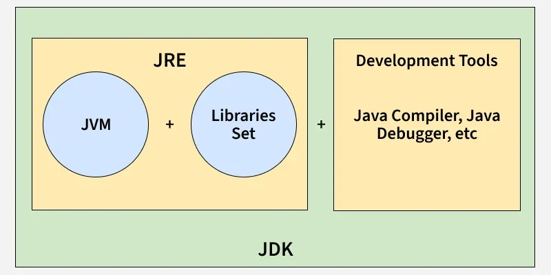

# Introduction to Java

Java is a popular, general-purpose **programming language** known for its **portability** (runs on various devices and operating systems), **object-oriented design** (organizing code around "objects"), and **robust standard library** (a collection of pre-made code for common tasks). Java is widely used to build a range of applications, from desktop to web, mobile, and enterprise software.

---

## Programming Paradigms

1. Object-Oriented Programming (OOP): Java emphasizes classes and
   objects, with support for inheritance, encapsulation, polymorphism, and
   abstraction.
2. Imperative Programming: Java allows for programming with explicit
   statements and commands to change program state, using constructs like
   loops and conditionals.
3. Procedural Programming: Java supports procedural code organization,
   where functions or methods operate on data and control program flow.
4. Concurrent Programming: Java provides built-in support for
   multithreading and concurrency, using classes from the `java.util.concurrent`
   package.
5. Functional Programming: Introduced in Java 8, Java supports functional
   programming with lambda expressions, the Stream API, and functional
   interfaces.
6. Generic Programming: Java enables type-safe operations on objects
   through generics, allowing classes and methods to operate on specified
   types.



## JDK (Java Development Kit)

- **What it is**: The JDK is a full package for **developing** Java applications.
- **Purpose**: It includes the JRE (to run Java programs) and also has tools like the **compiler (`javac`)**, which is used to compile Java code into bytecode, **utilities** like jar and javadoc.
- **Example use**: When you're writing Java code in an IDE (like IntelliJ IDEA or Eclipse), the JDK is required to compile and run the program.

J2EE, Java EE and Jakarta EE are all names for the same platform (Java Enterprise Edition) for building enterprise-level applications in Java. The name has evolved over time due to changes in ownership and branding:

## JRE (Java Runtime Environment)

- **What it is**: The JRE is a part of the Java platform that provides an environment to **run** Java applications.
- **Purpose**: It includes the **Java Virtual Machine (JVM)** and **core libraries** needed to execute Java code, but it does not include tools for compiling, developing or debugging Java programs.
- **Example use**: If you download a Java application to your computer, the JRE is what allows it to run.

## JVM (Java Virtual Machine)

- **What it is**: The core execution engine of Java. It converts bytecode into machine - specific instructions.
- **Purpose** : Acts as the abstract machine that provides a runtime environment, handle tasks like memory management, garbage collection and execute code.
  A Just-in-Time (JIT) compiler can also be used by the JVM to convert frequently used bytecode into faster native machine code.

---

## How Java Code Works

1. **Write Java Code**: Java code is written in `.java` files as source code.
2. **Compilation**: The `javac` compiler (part of the JDK) compiles this code into **bytecode** (`.class` files), which is platform-independent.
3. **Execution by the JVM**: The JVM (within the JRE) **interprets** or **JIT-compiles** this bytecode to machine code ("binary") specific to the operating system (Windows, Linux, etc.), making it platform-independent.

```java
public static void main(String[] args) {
   System.out.println("Hello World!");
}
```

is the entry point of any Java application as it tells the JVM where to start executing the program.

## JAR (Java ARchive)

is a package file format used to aggregate many Java class files, associated metadata, and resources (text, images, etc.) into one file for distribution. It's essentially a ZIP file with a .jar extension.

JAR files bundle up a complete Java application, library or collection of resources - making it easy to deploy Java apps to end-users in environments. JAR files can separate and organise code into different modules.

`C:\Users\sakus\Documents\Coding\java-fundamentals\target>jar tf java-fundamentals-1.0-SNAPSHOT.jar` - to view contents of JAR file

Classpath environment variables tells JVM where to find classes and resources. It's a list of directories and JAR files. In Spring Boot, the classpath is auto managed by Maven.
To specify manually

- ENV variable - `CLASSPATH=.;C:\path\to\my\jars\* `
- Command - `java -cp ".;C:\path\to\my\jars\*" com.example.MyMainClass`

---

## Statically Typed Language

- **Explanation**: Java is a **statically typed language**, meaning that variable types are defined at compile-time (you must declare the type of each variable before using it).
- **Example**:
  ```java
  int age = 30; // 'age' is declared as an integer type
  ```

---

## Interpretation in Java

Java bytecode is interpreted by the JVM at runtime, making it cross-platform. However, modern JVMs use Just-In-Time (JIT) compilation to improve performance, translating bytecode to native machine code as needed during execution.

## Multithreading

- **What it is:** Java has built-in support for multithreading, allowing multiple threads (smaller units of a process) to run simultaneously.
- **Benefit** Multithreading enables Java programs to perform multiple tasks concurrently, improving efficiency. For example, a Java application can download files while simultaneously handling user input.

## Setting up JDK

1. Download the JDK from the [official Oracle website](https://www.oracle.com/java/technologies/javase-jdk11-downloads.html) or use an open-source version like OpenJDK.
2. Install the JDK by following the installation instructions for your operating system.
3. Set the `JAVA_HOME` environment variable to point to the JDK installation directory.
4. Update the `PATH` environment variable to include the `bin` directory of the JDK installation.
