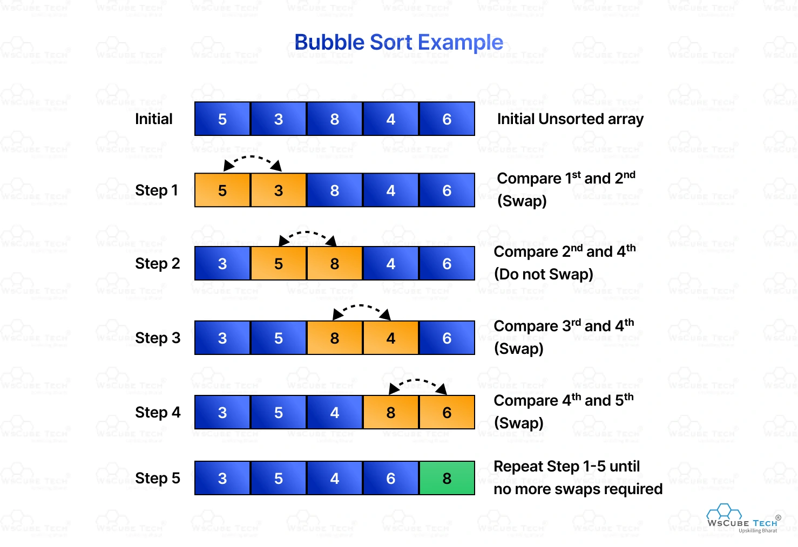
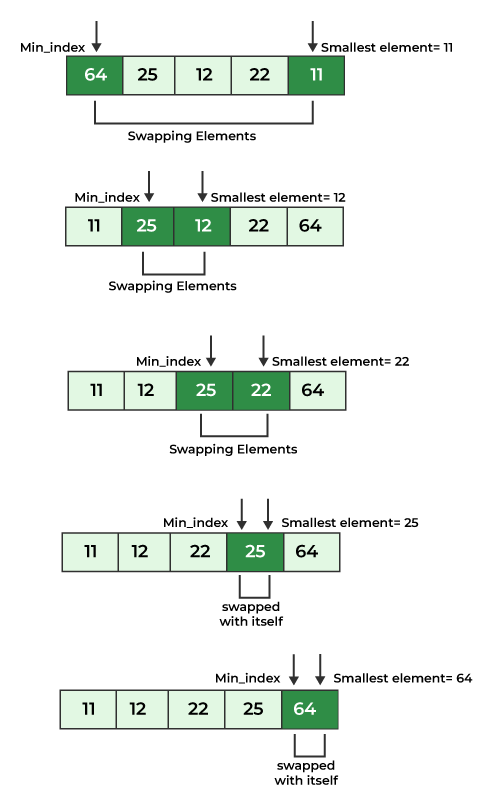

# Algorithms

## Algorithms are step-by-step procedures or rules for solving specific problems or performing tasks. They are fundamental to computer science and programming, enabling efficient data processing, problem-solving, and decision-making.

# Recursive

Recursion is a programming technique where a function calls itself to solve smaller instances of the same problem until reaching a base case. It is often used for problems that can be broken down into smaller, similar subproblems.

Recursion involves two main components:
1. Base Case: The condition under which the recursion stops. It prevents infinite recursion (Stack Overflow) and provides a direct solution for the simplest instance of the problem.
2. Recursive Case: The part of the function where it calls itself with a modified argument, gradually approaching the base case.

**Advantages of Recursion**:
- Simplifies code: Complex problems can be solved in fewer lines of code compared to iterative solutions.
- Natural representation: Problems that are recursive in nature (like tree traversals, factorial, Fibonacci, etc.) are easier to express.
- Reduces code complexity: Avoids writing nested loops, making the logic more readable and elegant.
- Useful in divide-and-conquer algorithms: Essential for algorithms like QuickSort, MergeSort, Binary Search, and Dynamic Programming.

**Disadvantages of Recursion**:
- High memory usage: Each recursive call adds a new layer to the function call stack, which may lead to memory overhead.
- Risk of stack overflow: Without proper base cases, infinite recursion can occur and crash the program.
- Slower execution: Function calls and returns add extra overhead compared to simple loops.
- Harder to debug: Tracing recursive calls can be confusing, especially in deep recursion.

# Divide and Conquer

Divide and Conquer is an algorithm design paradigm that breaks a problem into smaller subproblems, solves each subproblem independently, and then combines their solutions to solve the original problem. Common examples include Merge Sort and Quick Sort.

# Dynamic Programming

Dynamic Programming (DP) is an optimization technique used to solve complex problems by breaking them down into simpler overlapping subproblems. It stores the results of subproblems to avoid redundant computations, typically using either a top-down (memoization) or bottom-up (tabulation) approach.

# Greedy Algorithms

Greedy Algorithms are a problem-solving approach that builds a solution piece by piece, always choosing the next piece that offers the most immediate benefit or the most optimal local solution. Greedy algorithms do not always guarantee a globally optimal solution but can be efficient for certain problems, such as Prim's and Kruskal's algorithms for Minimum Spanning Trees.

# Brute Force

Brute Force is a straightforward problem-solving approach that involves trying all possible solutions until the correct one is found. It is often used when the solution space is small or when no efficient algorithm exists for the problem. While simple to implement, brute force methods can be inefficient for large datasets due to their high time complexity.

# Randomized

Randomized algorithms use random numbers or random choices as part of their logic to solve problems. They can provide efficient solutions for complex problems where deterministic algorithms may be too slow or complicated. Examples include Randomized Quick Sort and Monte Carlo methods.

---

## Maths

### Last digit of number

To find the last digit of a number, you can use the modulus operator `%` with 10. The last digit of any integer `n` can be obtained by calculating `n % 10`.

```java
int lastDigit(int n) {
    return Math.abs(n % 10); // Use Math.abs to handle negative numbers
}

// Example usage:
int number = 12345;
int lastDigit = lastDigit(number); // lastDigit will be 5
```

### Remove last digit of number

To remove the last digit of a number, you can perform an integer division by 10. This effectively shifts the digits to the right, discarding the last digit.

```java
int removeLastDigit(int n) {
    return n / 10; // Integer division removes the last digit
}
// Example usage:
int number = 12345;
int newNumber = removeLastDigit(number); // newNumber will be 1234
```

### Sum of series
The sum of the first `n` natural numbers can be calculated using the formula:

```java
int sumOfSeries(int n) {
    return n * (n + 1) / 2; // Formula for the sum of first n natural numbers
}
```

## Arrays

### Traversal

Traversal patterns mean visiting each node in a data structure at least once.

#### Left to Right - `O(n)`

```java
for (int i = 0; i < arr.length; i++) {
    System.out.println(arr[i]);
}
```

- Counting, summing, or searching elements in an array.
- Finding the maximum or minimum value in an array.

#### Right to Left - `O(n)`

```java
for (int i = arr.length - 1; i >= 0; i--) {
    System.out.println(arr[i]);
}
```

- Suffix computations.
- Reversing an array.

### Prefix Sums

A prefix sum array is an auxiliary array that stores the cumulative sum of elements up to each index.

```java
int[] prefixSums(int[] arr) {
    int n = arr.length;
    int[] prefixSums = new int[n];
    prefixSums[0] = arr[0]; // First element is the same
    for (int i = 1; i < n; i++) {
        prefixSums[i] = prefixSums[i - 1] + arr[i]; // Previous sum + current element
    }
    return prefixSums;
}
```

### Suffix Sums

A suffix sum array is an auxiliary array that stores the cumulative sum of elements from each index to the end of the array.

```java
int[] suffixSums(int[] arr) {
    int n = arr.length;
    int[] suffixSums = new int[n];
    suffixSums[n - 1] = arr[n - 1]; // Last element is the same
    for (int i = n - 2; i >= 0; i--) {
        suffixSums[i] = suffixSums[i + 1] + arr[i]; // Next sum + current element
    }
    return suffixSums;
}
```

### Difference Arrays

A difference array is an auxiliary array that helps efficiently perform (`O(1)`) range update operations on an array. If you want to add a value to all elements in a range `[l, r]`, you can use a difference array (diff) to achieve this efficiently instead of updating each element in the range individually.

```java
void rangeUpdate(int[] arr, int l, int r, int val) {
    int n = arr.length;
    int[] diff = new int[n + 1]; // One extra space to avoid n+1 index out of bounds and make calculations easier
    diff[l] += val; // Start of the range increase by val
    if (r + 1 < n) { // End of the range reached
        diff[r + 1] -= val; // End of the range + 1
    }

    // Apply the difference array to get the updated array
    int current = 0;
    for (int i = 0; i < n; i++) {
        current += diff[i];
        arr[i] += current;
    }
}
```

`l` and `r` are the starting and ending indices of the range (inclusive), and `val` is the value to be added to each element in that range.

`int[] diff = new int[n + 1];` creates a difference array with one extra element to handle the end of the range update without going out of bounds.

`arr = [1,1,1,1,1]`  
`l = 1`  
`r = 3`  
`val = 2`

1. Allocate `diff` array

```scss
diff indices:  0  1  2  3  4  5
diff initial = [0, 0, 0, 0, 0, 0]
```

2. Apply `diff[l] += val` -> `diff[1] += 2`

```scss
diff after l = [0, 2, 0, 0, 0, 0]
```

3. Apply `diff[r + 1] -= val` -> `diff[4] -= 2`

```scss
diff after r+1 = [0, 2, 0, 0, -2, 0]
```

4. Construct the updated array by applying the difference array

| i   | diff[i] | current (after adding diff[i]) | arr before | arr after = arr before + current |
| --- | ------: | -----------------------------: | ---------: | -------------------------------: |
| 0   |       0 |                              0 |          1 |                    1 (no change) |
| 1   |       2 |                              2 |          1 |                        3 (1 + 2) |
| 2   |       0 |                              2 |          1 |                        3 (1 + 2) |
| 3   |       0 |                              2 |          1 |                        3 (1 + 2) |
| 4   |      -2 |                   0 (2 + (-2)) |          1 |             1 (back to original) |

Final updated `arr = [1, 3, 3, 3, 1]`

Difference arrays are particularly useful when you have multiple range update operations to perform on an array, as they allow you to apply all updates in `O(n + k)` time, where `k` is the number of updates, instead of `O(n * k)` if you were to update each element in the range individually for each operation.

### Kadane’s Algorithm (Maximum Subarray Sum)

Kadane’s Algorithm is an efficient method to find the maximum sum of a contiguous subarray within a one-dimensional array of numbers. It operates in linear time `O(n)` and uses a dynamic programming approach.

```java
int kadaneMaxSubarray(int[] arr) {
    int maxSoFar = arr[0]; // max sum of subarray that ends at current position
    int maxEndingHere = arr[0]; // overall max sum found so far

    for (int i = 1; i < arr.length; i++) {
        maxEndingHere = Math.max(arr[i], maxEndingHere + arr[i]); // either start new subarray at arr[i] or extend existing
        maxSoFar = Math.max(maxSoFar, maxEndingHere); // update overall max if extending gives a better sum
    }

    return maxSoFar;
}
```

## Sliding Window

Uses two pointers to create a window (continuous range) that can either be fixed or variable in size and slides over the data structure to solve problems related to subarrays or substrings. The window slides through the array instead of recalculating values for each position, improving efficiency.

### Fixed Window

Use when the size of the window is constant.

Example: Find the maximum sum, average of any subarray of size `k`.

```java
public static int maxSumFixed(int[] arr, int k) {
    int maxSum = 0;
    int windowSum = 0;

    for (int i = 0; i < arr.length; i++) {
        windowSum += arr[i]; // Add the next element to the window

        // Slide the window when we reach size k
        if (i >= k - 1) {
            maxSum = Math.max(maxSum, windowSum); // Check if current window sum is greater than max
            windowSum -= arr[i - (k - 1)]; // Remove the element going out of the window
        }
    }
    return maxSum;
}
```

### Variable Window

Use when the size of the window can change based on conditions.

Example : Find the smallest subarray with a sum greater than or equal to target.

```java
public static int minSubArrayLen(int target, int[] nums) {
    int left = 0; // Left pointer of the window
    int sum = 0; // Current sum of the window
    int minLen = Integer.MAX_VALUE; // Minimum length of window

    for (int right = 0; right < nums.length; right++) {
        sum += nums[right]; // Expand the window by adding the right element

        // Check if condition hit then contract the window from the left to see if we can get a smaller valid window
        while (sum >= target) {
            minLen = Math.min(minLen, right - left + 1); // Update minimum length (+1 because both ends are inclusive)
            sum -= nums[left]; // Contract the window from the left
            left++; // Increment left pointer
        }
    }
    return minLen == Integer.MAX_VALUE ? 0 : minLen;
}
```

Example : Find the longest substring without repeating characters.

```java
public static int lengthOfLongestSubstring(String s) {
    Set<Character> window  = new HashSet<>(); // To store unique characters
    int left = 0; // Left pointer of the window
    int maxLength = 0; // Maximum length of substring found

    for (int right = 0; right < s.length(); right++) {
        char c = s.charAt(right); // Current character at right pointer

        // If character is already in the set, shrink the window from the left until it's removed
        while (window.contains(c)) {
            window.remove(s.charAt(left)); // Remove characters until no duplicates
            left++; // Increment left pointer
        }
        window.add(c); // Add current character to the window

        maxLength = Math.max(maxLength, right - left + 1);
    }
    return maxLength;
}
```

### Frequency Map Sliding Window

Likely to use a HashMap to track frequencies of elements within the current window. This is useful for problems that require counting occurrences, finding anagrams, or checking for specific frequency conditions within a substring or subarray.

Example: Longest Substring with At Most K Distinct Characters (if K = 2 then longest substring with at most 2 distinct characters)

```java
public static int longestKDistinct(String s, int k) {
    Map<Character, Integer> freq = new HashMap<>(); // Frequency map to count characters in the current window
    int left = 0; // Left pointer of the window
    int maxLen = 0; // Maximum length of substring found

    for (int right = 0; right < s.length(); right++) {
        char c = s.charAt(right); // Current character at right pointer
        freq.put(c, freq.getOrDefault(c, 0) + 1); // Add current character / count to the frequency map

        // If we have more than k distinct characters, shrink the window from the left
        while (freq.size() > k) {
            char leftChar = s.charAt(left); // Character at left pointer
            freq.put(leftChar, freq.get(leftChar) - 1); // Decrease its count
            if (freq.get(leftChar) == 0) freq.remove(leftChar); // Remove it from map if count is zero
            left++;
        }

        maxLen = Math.max(maxLen, right - left + 1); // Update maximum length
    }
    return maxLen;
}
```

### Min/Max Window Problems

Example: Minimum Window Substring - find the smallest substring `s` containing all characters of a given string `t` including duplicates.

s = "ADOBECODEBANC"  
t = "ABC"

```java
public static String minWindow(String s, String t) {
    if (t.length() > s.length()) return ""; // Edge case

    Map<Character, Integer> need = new HashMap<>(); // Frequency map for required characters in t
    for (char c : t.toCharArray()) {
        need.put(c, need.getOrDefault(c, 0) + 1);
    }

    Map<Character, Integer> window = new HashMap<>(); // Frequency map for characters in the current window
    int have = 0; // Number of distinct characters that meet the required frequency
    int needCount = need.size(); // Total unique characters needed
    int left = 0; // Left pointer of the window
    int minLen = Integer.MAX_VALUE; // Minimum length of the smallest window found
    int minStart = 0; // Start index of the minimum window found

    for (int right = 0; right < s.length(); right++) {
        char c = s.charAt(right);
        window.put(c, window.getOrDefault(c, 0) + 1); // Add current character to the window

        // Check if current characters in window meets the needed frequency,
        // if window has enough of character c no need to increment have
        if (need.containsKey(c) && window.get(c) <= need.get(c)) {
            have++;
        }

        // Try to contract the window until it ceases to be valid
        while (have == needCount) {
            // window is valid, update minimum length if smaller window found
            if (right - left + 1 < minLen) {
                minLen = right - left + 1;
                minStart = left; // Update start index of new minimum window
            }

            char leftChar = s.charAt(left);
            window.put(leftChar, window.get(leftChar) - 1); // Remove left character from window

            // If character going out of window is in need and its frequency in window is now less than needed, decrement have
            if (need.containsKey(leftChar) && window.get(leftChar) < need.get(leftChar)) {
                have--; // Window is no longer valid
            }
            left++; // Move left pointer to contract the window
        }
    }
    return minLen == Integer.MAX_VALUE ? "" : s.substring(minStart, minStart + minLen);
}
```

## Strings I

### Palindrome Patterns

### Frequency Array Patterns

### Basic String Traversal

### Two-Pointer String Problems

## Strings II

### Anagram Patterns

Example : Find All Anagrams in a String - Given a string `s` and a non-empty string `p`, find all the start indices of `p`'s anagrams in `s`. The order of output does not matter.

s = "cbaebabacd"  
p = "abc"

```java
public static List<Integer> findAnagrams(String s, String p) {
    List<Integer> result = new ArrayList<>();
    if (s.length() < p.length()) return result;

    int[] freqP = new int[26];       // frequency counts of pattern
    int[] freqWindow = new int[26];  // frequency counts of sliding window

    // Build frequency map of pattern p
    for (char c : p.toCharArray()) {
        freqP[c - 'a']++; // [char - 'a'] to map 'a' to 0, 'b' to 1,...
    }

    int windowSize = p.length();
    int left = 0;

    // Slide over the string s
    for (int right = 0; right < s.length(); right++) {
        // Add current char to window frequency
        freqWindow[s.charAt(right) - 'a']++;

        // If window size matches pattern size
        if (right - left + 1 == windowSize) {

            // Compare window and pattern frequencies
            if (Arrays.equals(freqP, freqWindow)) {
                result.add(left);
            }

            // Remove leftmost char before sliding left pointer
            freqWindow[s.charAt(left) - 'a']--;
            left++;  // shrink window from left
        }
    }

    return result;
}
```

### Permutation & Substring Matching

### Frequency Match Windows

### Fixed Window String Problems

## Sorting Patterns
Sorting is a fundamental algorithmic technique used to arrange elements in a specific order, typically in ascending or descending order. Various sorting algorithms exist, each with its own approach and efficiency characteristics.

### Bubble (Sinking) Sort - O(n^2)
Repeatedly compare adjacent elements and swap them if they are in the wrong order. The largest unsorted element "bubbles" to its correct position at the end of the array with each pass.



```css
[5, 3, 8, 4, 2]
[3, 5, 4, 2, 8] // After first pass 5 <-> 3 , 8 <-> 4, 8 <-> 2 (largest element 8 is now at the end)
[3, 4, 2, 5, 8] // After second pass 5 <-> 4 ,5 <-> 2 (second largest element 5 is now at its correct position)
[3, 2, 4, 5, 8] // After third pass 4 <-> 2 (third largest element 4 is now at its correct position)
[2, 3, 4, 5, 8] // After fourth pass 3 <-> 2 (fourth largest element 3 is now at its correct position, and the array is sorted)
```
After `n - 1` passes, the array is sorted.

```java
void bubbleSort(int[] arr) {
    int n = arr.length;
    for (int i = 0; i < n - 1; i++) { // Number of passes (n - 1)
        for (int j = 0; j < n - i - 1; j++) { // Last i elements are already sorted from previous passes
            if (arr[j] > arr[j + 1]) {
                // Swap arr[j] and arr[j+1]
                int temp = arr[j];
                arr[j] = arr[j + 1];
                arr[j + 1] = temp;
            }
        }
    }
}
```

### Selection Sort - O(n^2)
Algorithm divides the input list into two parts: a sorted sublist and an unsorted sublist. It repeatedly selects the smallest (or largest) element from the unsorted sublist and moves it to the end of the sorted sublist.



```
[64, 25, 12, 22, 11]
[11 | 25, 12, 22, 64] // After first pass (smallest element 11 is now at the beginning)
[11, 12 | 25, 22, 64] // After second pass (next smallest element 12 is now in its correct position)
[11, 12, 22 | 25, 64] // After third pass (next smallest element 22 is now in its correct position)
[11, 12, 22, 25 | 64] // After fourth pass (next smallest element 25 is now in its correct position)
```

`sorted | unsorted`

After `n - 1` passes, the array is sorted.

```java
void selectionSort(int[] arr) {
    int n = arr.length;
    for (int i = 0; i < n - 1; i++) { // Number of passes (n - 1)
        int minIdx = i; // Assume the minimum is the first element of unsorted part
        for (int j = i + 1; j < n; j++) {
            if (arr[j] < arr[minIdx]) {
                minIdx = j; // Update index of minimum element
            }
        }
        if  (minIdx == i) continue; // No need to swap if the minimum is already at the correct position

        // Swap the found minimum element with the first element of unsorted part
        int min = arr[minIdx]; // Holds the minimum value
        arr[minIdx] = arr[i]; // Swap first unsorted element at the position of minimum
        arr[i] = min; // Place minimum at its correct position
    }
}
```

### Insertion Sort - O(n^2)
Insertion Sort builds a sorted array one element at a time by repeatedly taking the next element from the unsorted portion and inserting it into its correct position in the sorted portion.


```
[12, 11, 13, 5, 6]
[11, 12 | 13, 5, 6] // After first pass (11 is inserted before 12)
[11, 12, 13 | 5, 6] // After second pass (13 is already in correct position)
[5, 11, 12, 13 | 6] // After third pass (5 is inserted at the beginning)
[5, 6, 11, 12, 13] // After fourth pass (6 is inserted between 5 and 11)
```

After `n - 1` passes, the array is sorted.

```java
void insertionSort(int[] arr) {
    int n = arr.length;
    for (int i = 1; i < n; i++) { // Start from the second element
        int key = arr[i]; // Current element to be inserted
        int j = i; // Index of current element

        // Move elements of arr[0..i-1], that are greater than key,
        // to one position ahead of their current position
        while (j > 0 && arr[j - 1] > key) {
            arr[j] = arr[j - 1]; // Shift element to the right
            j--;
        }
        arr[j] = key; // Insert the key at its correct position
    }
}
```
### Merge Sort - O(n log n)
Merge Sort is a divide-and-conquer algorithm that divides the input array into two halves, recursively sorts each half till they cannot be divided further, and then merges the sorted halves back together.

```java
void mergeSort(int[] inputArray) { 
    int inputLength = inputArray.length;

    if (inputLength < 2) { // One or zero elements are already sorted
        return; // Base case: array is already sorted
    }

    int midIndex = inputLength / 2; // Find the midpoint to divide the array
    int[] leftHalf = new int[midIndex]; // Create left subarray of size half of input array
    int[] rightHalf = new int[inputLength - midIndex]; // Create right subarray with remaining elements, cannot use midIndex here directly if inputLength is odd

    // Fill left subarray
    for (int i = 0; i < midIndex; i++) {
        leftHalf[i] = inputArray[i];
    }
    for (int i = midIndex; i < inputLength; i++) {
        rightHalf[i - midIndex] = inputArray[i]; // Start at index 0 of rightHalf but i starts from midIndex of inputArray
    }

    mergeSort(leftHalf);
    mergeSort(rightHalf);

    merge(inputArray, leftHalf, rightHalf);
}

void merge(int[] inputArray, int[] leftHalf, int[] rightHalf) {
    int leftSize = leftHalf.length;
    int rightSize = rightHalf.length;

    int i = 0, j = 0, k = 0; // i for leftHalf, j for rightHalf, k for inputArray

    // Merge the two halves into inputArray
    while (i < leftSize && j < rightSize) { // loop until we reach the end of either leftHalf or rightHalf
        if (leftHalf[i] <= rightHalf[j]) {
            inputArray[k++] = leftHalf[i++]; // Take element from leftHalf
        } else {
            inputArray[k++] = rightHalf[j++]; // Take element from rightHalf
        }
    }

    // Copy remaining elements of leftHalf, if any
    while (i < leftSize) {
        inputArray[k++] = leftHalf[i++];
    }

    // Copy remaining elements of rightHalf, if any
    while (j < rightSize) {
        inputArray[k++] = rightHalf[j++];
    }
} 
```

`int[] inputArray = {5, 3, 8, 4};`

```java
void mergeSort(int[] inputArray) {
    mergeSort(leftHalf); 
    mergeSort(rightHalf);
    merge(inputArray, leftHalf, rightHalf); // Merges sorted leftHalf and rightHalf into inputArray
}
```

```css
mergeSort([5, 3, 8, 4])
    mergeSort([5, 3])
        mergeSort([5]) → [5]
        mergeSort([3]) → [3]
        merge([5,3], [5], [3]) → [3, 5]
    mergeSort([8, 4])
        mergeSort([8]) → [8]
        mergeSort([4]) → [4]
        merge([8, 4], [8], [4]) → [4, 8]
    merge([5, 3, 8, 4], [3, 5], [4, 8]) → [3, 4, 5, 8]
```

```css
                [5, 3, 8, 4]
                /           \
          [5, 3]             [8, 4]
          /   \              /    \
       [5]   [3]         [8]     [4]
          \   /              \    /
          [3,5]             [4,8]
                \          /
                [3,4,5,8]
```

### Quick Sort - O(n log n) on average
Quick Sort is a divide-and-conquer algorithm that selects a 'pivot' element from the array and partitions the other elements into two sub-arrays according to whether they are less than or greater than the pivot. The sub-arrays are then sorted recursively.

```java
void quickSort(int[] array, int lowIndex, int highIndex) { // low and high index give the sub-array to be sorted

    if (lowIndex >= highIndex) {
        return; // Base case: If the sub-array has one or no elements, it's already sorted
    }

    int pivot = array[highIndex]; // Choosing the last element as pivot
    int leftPointer = lowIndex; // Pointer for the left index
    int rightPointer = highIndex - 1; // Pointer for the right index

    while(leftPointer <= rightPointer) { // Continue until pointers cross
        // Move leftPointer to the right as long as elements are less than pivot
        while (leftPointer <= rightPointer && array[leftPointer] <= pivot) {
            leftPointer++;
        }
        // Move rightPointer to the left as long as elements are greater than pivot
        while (rightPointer >= leftPointer && array[rightPointer] >= pivot) {
            rightPointer--;
        }
        // Swap elements at leftPointer and rightPointer if they are out of  order
        if (leftPointer < rightPointer) {
            swap(array, leftPointer, rightPointer);
        }
    }

    // After crossing, swap pivot from highIndex to left pointer / right pointer position
    swap(array, leftPointer, highIndex);

    // Recursively sort elements before and after partition
    quickSort(array, lowIndex, leftPointer - 1); // Sort left sub-array
    quickSort(array, leftPointer + 1, highIndex); // Sort right sub-array
}

void swap(int[] array, int i, int j) {
    int temp = array[i];
    array[i] = array[j];
    array[j] = temp;
}
```

## Searching Patterns
### Binary Search
An efficient algorithm for finding a target value within a sorted array. It works by repeatedly dividing the search interval in half, eliminating half of the remaining elements from consideration until the target is found or the interval is empty.

```java
int binarySearch(int[] arr, int target) {
    int left = 0;
    int right = arr.length - 1;

    while (left <= right) { // Continue till pointers do not cross
        int mid = left + (right - left) / 2; // To avoid potential overflow

        if (arr[mid] == target) {
            return mid; // Target found
        } else if (arr[mid] < target) {
            left = mid + 1; // Search in the right half
        } else {
            right = mid - 1; // Search in the left half
        }
    }
    return -1; // Target not found
}
``` 

`int mid = left + (right - left) / 2;` is used instead of `int mid = (left + right) / 2;` to prevent potential integer overflow when `left` and `right` are large values. By calculating the difference `(right - left)` first, we ensure that the sum does not exceed the maximum value for integers.

```java
int[] arr = {1, 2, 3, 4, 5, 6, 7, 8, 9};
int index = Array.binarySearch(arr, 5); // index will be 4
``` 

| Condition            | Meaning       | Action                 |
| -------------------- | ------------- | ---------------------- |
| `arr[mid] < target`  | mid too small | move `left = mid + 1`  |
| `arr[mid] > target`  | mid too big   | move `right = mid - 1` |
| `arr[mid] == target` | found         | return                 |

Lower Bound and Upper Bound variations can be implemented by adjusting the conditions for moving the `left` and `right` pointers.

**Lower Bound** is the first occurrence of the target value `arr[i] >= x`.
```java
if (arr[mid] >= target)
    index = mid; // potential lower bound
    right = mid - 1; // try smaller indices
else
    left = mid + 1;
```

**Upper Bound** is the first occurrence of a value greater than the target `arr[i] > x`.
```java
if (arr[mid] > target)
    index = mid; // potential upper bound
    right = mid - 1; // move left & try smaller indexes
else
    left = mid + 1; // arr[mid] <= target, move right   
```
### Sorting-Based Tricks

### Sweep Line Patterns

### Interval Sorting Problems

### Dutch National Flag (3-Way Partition)

## HashMap / HashSet

### Frequency Counting

### Duplicate Detection

### O(1) Lookup Patterns

### Hash-Based Pair/Group Problems

## Two Pointers

### Opposite-End Two Pointers

### Slow/Fast Pointers

### Sorted Array Pair Logic

### Cycle Detection

## Linked Lists I

### Linked List Construction

### Traversal Patterns

### Dummy Node Technique

### Pointer Manipulation Basics

## Linked Lists II

### Palindrome Linked List Pattern

### Partitioning Lists

### Finding Middle Node

### Multi-Pass Traversal Patterns

### Reversal Variants

## Stacks + Monotonic Stack

### Valid Parentheses Patterns

### Monotonic Stack (Next Greater/Smaller)

### Stack-Based Linear Processing

### Nearest Element Problems

## Queues + Deque

### FIFO Patterns

### Circular Queue Logic

### Monotonic Deque

### Sliding Window Maximum

## Binary Search Basics

### Classic Binary Search

### Lower/Upper Bounds

### Search in Sorted Array

## Binary Search on Answer

### Monotonic Predicate Search

### Feasibility Checking

### Binary Search on Solution Space


## Prefix Sums II

### Range Query Optimization

### Prefix Hashing

### Subarray Sum Count (e.g., Sum = K)

## DP Basics

### Memoization

### Tabulation

### Min/Max / Count DP

### Recurrence-Based DP

## DP on Subsequences

### LIS / LCS Patterns

### Subsequence DP (Non-Contiguous)

### Prefix Comparison DP

## Knapsack DP

### 0/1 Knapsack

### Subset Sum Variants

### Take/Not-Take DP Pattern

## DP on Grids

### Path Counting DP

### Minimum Path Cost DP

### 2D DP with Grid Boundaries

## DP on Intervals

### Interval DP

### Partition-Based DP

### Palindromic Interval DP

## Trees Basics

### DFS Tree Traversal

### BFS Tree Traversal

### Tree Depth / Height Patterns

## BST (Binary Search Tree)

### Inorder Traversal

### Search/Insert/Delete Patterns

### BST Property Applications

## Trees Advanced

### Lowest Common Ancestor (LCA)

### Tree Diameter

### Depth Tracking DFS

## Graphs BFS/DFS

### Adjacency List Graph Representation

### Connected Component Search

### DFS/BFS Exploration

### Island/Region Problems

## Graph Topological Sort

### Kahn’s Algorithm

### DAG Ordering

### In-Degree Based Processing

## Shortest Path

### Dijkstra’s Algorithm

### BFS for Unweighted Paths

### Weighted Graph Traversal

## Heaps & Priority Queue

### Top-K Problems

### Heap-Based Partial Sorting

### Priority Queue Applications

## Tries

### Prefix Tree Structure

### Autocomplete Logic

### Prefix Matching Patterns

## Bit Manipulation

### XOR Tricks

### Bitmasking

### Odd/Even Occurrence Patterns

## Mixed Review

### Combined Patterns

### Hybrid Techniques

### Pattern Identification Practice
