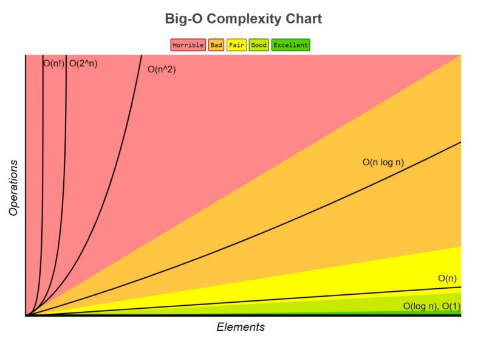

Big O Notation is used to describe the time complexity and space complexity of an algorithm.
It tells you how the runtime or memory usage grows relative to input size (n).

* Helps compare algorithms’ efficiency. 
* Focuses on worst-case performance. 
* Ignores machine-specific constants.

Example: If sorting n = 1,000,000 elements, 
* An O(n log n) algorithm might finish in seconds. 
* An O(n²) algorithm might take hours.

| Big O          | Name         | Example Scenario                           |
| -------------- | ------------ | ------------------------------------------ |
| **O(1)**       | Constant     | Accessing an array element by index        |
| **O(log n)**   | Logarithmic  | Binary search                              |
| **O(n)**       | Linear       | Traversing an array                        |
| **O(n log n)** | Linearithmic | Merge sort, quicksort (average case)       |
| **O(n²)**      | Quadratic    | Nested loops (bubble sort, insertion sort) |
| **O(2ⁿ)**      | Exponential  | Recursive Fibonacci                        |
| **O(n!)**      | Factorial    | Generating all permutations                |

