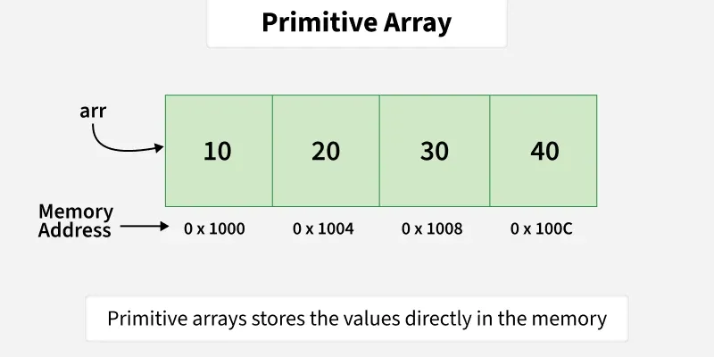
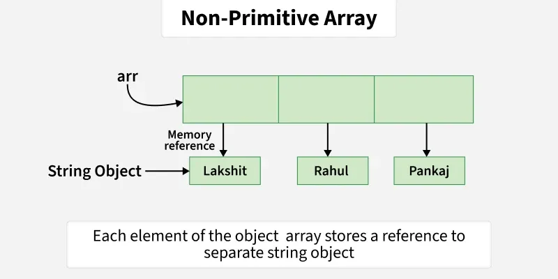

# Arrays
A linear data structure that allows multiple values of the same type to be stored. `Arrays` is a utility class that extends `Object`.

* Store Primitives and Objects: Java arrays can hold both primitive types (like int, char, boolean, etc.) and objects (like String, Integer, etc.)
* Contiguous Memory Allocation When we use arrays of primitive types, the elements are stored in contiguous locations. For non primitive types, references of items are stored at contiguous locations.
* Zero-based Indexing: The first element of the array is at index 0.
* Fixed Length: After creating an array, its size is fixed; we can not change it.




**Declaring an Array**
```java
int arr[];
```
Just tells compiler this variable `arr` will hold an array of integers

**Initialisation of an Array**
```java
int arr[] = new int[size];
```
Reference of an array is created with `new`, JVM allocates memory for an array of a given `size` in the heap.

The array size is dynamically allocated (decided at runtime not compile time) but statically fixed (cannot be changed). 

**Declare and Initialise**
```java
int intArr[] = { 10, 20, 15, 22, 35 };
```

**Multidimensional Array**

```java
int[][] arr = new int[1][3];

arr[0][0] = 3;
```

```java
int[][] arr = { { 1, 2 }, { 3, 4 } };
```

**Methods**
* `Arrays.asList()` - convert array to list
* `Arrays.binarySearch()` - `O(log(n))` - searches for element in a sorted array using binary search
* `Arrays.equals()` - `O(n)` - must compare each element in array 
* `Arrays.sort()` - `O(nlog(n))` - sorts an array in ascending order