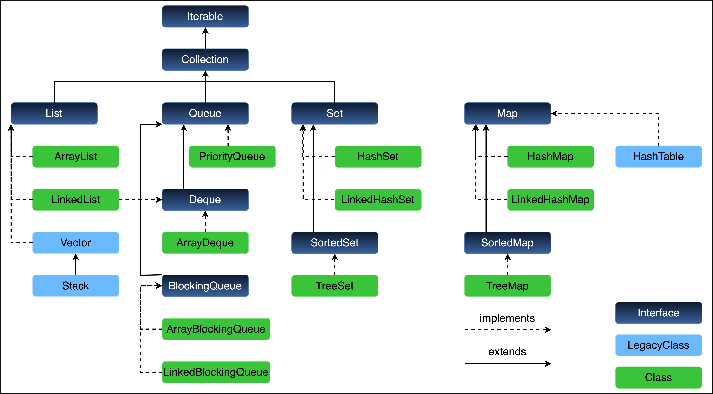
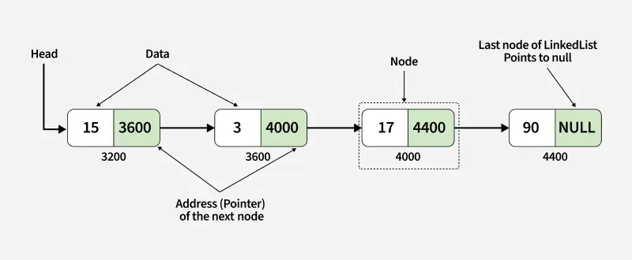

The Collections framework provides a set of interfaces, implementations and utilities in `java.util`
for storing, retrieving and manipulating groups of objects through standard data structures (list, sets, maps, queues),
algorithms (sort, shuffle) and interoperability (iterators, streams)

## 

# `Iterable<T>`

The root interface for anything that can be iterated (looped over).
`Iterator<T> iterator();` - provides an `Iterator` to traverse elements.

(Java 8+) `forEach(Consumer<? super T> action);` - perform action on each element.

(Java 8+) `Spliterator<T> spliterator();` - used in streams & parallel iteration.

Any class that implements `Iterable` can be used in a for-each loop. Only promises that you can loop through elements
but does not say how elements are stored, added, removed etc.

`Iterable` is general purpose (can iterate over a sequence of any type) so uses the generic type `T` (Type).
`Iterable<String>` then `T` = `String`.

---

# `Collection<E>`

The root interface of the Collections Framework and extends `Iterable<E>`.  
Defines the basic operations for a group of Objects(elements):

- `boolean add(E e)`
- `boolean remove(Object o)`
- `boolean contains(Object o)`
- `int size()`
- `boolean isEmpty()`
- `void clear()`
- `Object[] toArray()`
- `containsAll(Collection<?> c)`
- `boolean addAll(Collection<? extends E> c)`
- `boolean removeAll(Collection<?> c)`
- `void clear()`
- `void sort(Comparator<? super E> c)` - `O(n log n)`
- `int binarySearch(List<? extends Comparable<? super T>> list, T key)` - `O(log n)` , must be sorted first!

All list, sets and queues implement `Collection`.

`Collection` represents a group of elements therefore `Collection<E>` stores elements of type `E`.  
`Collection<Integer>` then `E` = `Integer` meaning collection stores elements of type `Integer`.

---

## `List<E>`

An ordered collection (sequence) of elements

- Maintains insertion order
- Allows duplicate elements
- Supports positional access via index
- Important methods:
  - `get(int index)`
  - `set(int index, E element)`
  - `indexOf(Object o)`
  - `lastIndexOf(Object o)`
  - `subList(int from, int to)`

---

### `ArrayList<E>`

A resizable-array implementation of `List`, used best for random access operations such as fast lookups
and fewer inserts/deletes in the middle. Elements are stored contiguously (connected without a break) in memory.

`ArrayList<E> arrayList = new ArrayList<>();`

- `get(int index)` → `O(1)`
- `set(int index, E e)` → `O(1)`
- `add(E e)` → Amortized `O(1)`
- `remove(int index)` → `O(n)`
  - Best Case: remove last element = no shift needed = `O(1)`
  - Worst Case: remove first element = shift all `n-1` elements to left = `O(n)`
  - Average: `n/2` shifts -> `O(n)` (drop constants to simplify in Big - O)
- `indexOf(Object o)` → `O(n)` - linear search from start to find first occurrence

---

### `LinkedList<E>`

A doubly-linked (each node has 2 references previous & next) list implementation of `List` (also `Deque`) used best for frequent insertions and deletions.  
Each node has reference to its previous and next node. Elements are not stored contiguously making it great for inserts / deletions
but not for random access. (Picture a train where each carriage points to the one before and after it)

`LinkedList<E> linkedList = new LinkedList<>();`

- `get(int index)` → `O(n)` - to access element at index `i`, must traverse node by node till index `i` is reached then need to update pointers (prev/next)
- `add/remove at ends` → `O(1)` - directly access head (first) or tail (last) node reference with no bulk shifting like `ArrayList`
- `add/remove in middle` → `O(n/2)` → `O(n)`


where tail pointer references last node

`LinkedList` achieves polymorphism by acting as `List`, `Deque` and `Queue` using it's linked node structure
and covering all necessary methods for each interface.

`List` - supports insertions, deletions and access at any position, not as fast as `ArrayList`
`Deque` - supports operations at both ends for LIFO or FIFO data structure
`Queue` - supports FIFO behaviour using `Deque` methods

### `ArrayList<E>` vs `LinkedList<E>`

| Operation              | `ArrayList`          | `LinkedList`                           |
| ---------------------- | -------------------- | -------------------------------------- |
| `get(int index)`       | **`O(1)`**           | **`O(n)`**                             |
| `add/remove at end`    | Amortized **`O(1)`** | **`O(1)`**                             |
| `add/remove in middle` | **`O(n)`**           | **`O(n)`**                             |
| Memory overhead        | Low (array)          | Higher (extra node objects + pointers) |

- Use `ArrayList` when you need fast random access and fewer insertions / deletions
- Use `LinkedList` when you need lots of insertions / deletions at ends

**Single Linked List** - each node has only a reference to the next node, not previous.


**Double Linked List** - each node has references to both previous and next nodes.


**Circular Linked List** - last node points back to first node forming a circle.


**Circular Doubly Linked List** - last node points to first and first points back to last.


---

### `Vector<E>`

Is a dynamic array, part of the legacy collection classes. It grows automatically as elements are added similar to `ArrayList`.  
It is synchronized, meaning thread-safe (only one thread can modify at a time) but slower than `ArrayList` in single - threaded contexts.

```java
Vector<String> vector = new Vector<>();

vector.add("Apple");
vector.add("Banana");
vector.add("Cherry");

System.out.println(vector.get(1)); // Banana
vector.remove("Banana");
```

---

### `Stack`

Is a sublcass of `Vector` that represents a **Last - In - First - Out (LIFO)** data structure.

Every push adds to the top of the stack, every pop removes the top element of the stack (like a stack of plates).

Inherits `Vector`'s synchronized behaviour. Uses the end of the vector as the stack top.

Vector with below array

```text
Index:   0   1    2    3
Data:   [10, 20, 30, 40]
```

Top of the stack is index 3 -> 40 and operations only manipulate the top (or last element in `Vector`)

`push(50)` → adds 50 at the end (index 4)

`pop()` → removes from the end

`peek()` → reads the end element without removing it

```java
Stack<Integer> stack = new Stack<>();
```

- `push(E e)` - `O(1)` - Pushes element on top of the stack with no shifting
- `pop()` - `O(1)` - Removes and returns the element at the top of the stack
- `peek()` - `O(1)` - Returns the element at the top of the stack without removing it
- `search(Object o)` - `O(n)` - Returns 1-based position from top, or -1 if not found via a linear scan

`search(Object o)` - searches the stack of the specified element `o`, if the element exists then it returns the
position counted from the top of the stack, starting at 1. If the element doesn't exist then returns -1.

So topmost element is position 1, second element from top position 2.

---

## `Queue`

Is a First - In - First - Out (FIFO) data structure where elements are added at the tail and removed from the head. First
element added is the first one to be removed similar to people waiting in a queue.

```java
Queue<String> queue = new LinkedList<>();
```

LinkedList implements both the List and the Deque(Queue) interfaces.
It can behave as both a list and a queue, depending on how you use it

- `add(E e)` - Inserts element; throws exception if full
- `offer(E e)` - Inserts element; returns false if full (safe alternative)
- `remove()` - Removes and returns head; throws exception if empty
- `poll()` - Removes and returns head; returns null if empty
- `element()` - Returns head; throws exception if empty
- `peek()` - Returns head; returns null if empty

---

### `PriorityQueue`

A `Queue` that orders elements by priority not insertion order. Uses natural ordering (`Comparable`) or custom `Comparator`.  
Internally implemented as a binary heap.

The head of the queue is the smallest (or highest priority) element.

Does not guarantee ordering of all elements when iterating (for - loop) as you're going through an internal heap array not a sorted `List`.

`null` elements are not allowed.

- `offer(E e)` - `O(log n)` - Element added at end, then “heapified up” (may bubble up through levels).
- `poll()` - `O(log n)` - Root removed, last element moved to top, then “heapified down.”
- `peek()` - `O(1)` - Root is always at index 0.
- `remove(Object o)` - `O(n)` - Must search entire heap array for object first.
- `c ontains(Object o)` - `O(n)` - Linear search through heap array.

Natural Ordering

```java
PriorityQueue<Integer> pq = new PriorityQueue<>();

pq.offer(30);
pq.offer(10);
pq.offer(20);

System.out.println(pq.poll()); // 10 (smallest)
System.out.println(pq);        // [20, 30]
```

Custom Comparator

```java
PriorityQueue<Integer> pq = new PriorityQueue<>(Comparator.reverseOrder());

pq.offer(10);
pq.offer(20);
pq.offer(5);

System.out.println(pq.poll()); // 20 (largest)
```

---

### `Deque`

A Double - Ended Queue that allows insertion and removal from both ends.

- `addFirst(E e)` - `O(1)` - Inserts at head
- `addLast(E e)` - `O(1)` - Inserts at tail
- `offerFirst(E e)` - Safe insert at head
- `offerLast(E e)` - Safe insert at tail
- `removeFirst()` - `O(1)` - `O(1)` - Removes from head
- `removeLast()` - `O(1)` - Removes from tail
- `peekFirst()` - `O(1)` - Returns head
- `peekLast()` - `O(1)` - Returns tail

```java
Deque<String> deque = new LinkedList<>();

deque.addFirst("A");
deque.addLast("B");
deque.addLast("C");

System.out.println(deque);       // [A, B, C]
System.out.println(deque.removeLast()); // removes C
System.out.println(deque);       // [A, B]
```

---

### `ArrayDeque`

A resizable array based implementation of `Deque` which is faster than `LinkedList` for stack and queue operations.

Not synchronized (not thread-safe) and doesn't allow null elements

As Queue

```java
Deque<String> queue = new ArrayDeque<>();
queue.offer("A");
queue.offer("B");
queue.offer("C");

System.out.println(queue.poll()); // removes A
System.out.println(queue);        // [B, C]
```

As Stack

```java
Deque<Integer> stack = new ArrayDeque<>();
stack.push(10);
stack.push(20);
stack.push(30);

System.out.println(stack.pop()); // 30
System.out.println(stack.peek()); // 20
```

---

### `BlockingQueue`

A thread - safe queue used in concurrent programming.

Supports blocking operations:

- Waits when adding to a full queue
- Waits when removing from an empty queue

---

| Feature     | Queue        | PriorityQueue       | Deque                   | ArrayDeque                 | BlockingQueue                    |
| ----------- | ------------ | ------------------- | ----------------------- | -------------------------- | -------------------------------- |
| Ordering    | FIFO         | By priority         | FIFO + LIFO             | FIFO + LIFO                | FIFO                             |
| Thread-safe | ❌           | ❌                  | ❌                      | ❌                         | ✅                               |
| Allows null | ✅           | ❌                  | ❌                      | ❌                         | ❌                               |
| Backed by   | LinkedList   | Binary heap         | LinkedList / ArrayDeque | Array                      | Varies                           |
| Common use  | Simple queue | Priority scheduling | Both stack/queue        | Fast general-purpose queue | Multi-threaded producer-consumer |

---

## `Set`

An interface that represents a collection of unique elements, which doesn't allow duplicates and no index based positional access.

`.equals()` and `.hashCode()` define uniqueness

- `.hashCode()` determines which "bucket" (array index) to check in the hash table. "Buckets" group together objects with possibly similar hash values
- `.equals()` checks actual equality within the "bucket", another object may have the same hashcode but not be the same object.
  - If `true` objects are considered true duplicates so new element will not be added
  - If `false` they are different objects even if hash codes match

### `HashSet`

An implementation of the `Set` interface, backed by a `HashMap` where elements are stored as keys in an internal map

```java
Set<String> set = new HashSet<>();
```

For each element, `.hashCode()` determines which "bucket" it's stored in, when two elements have the same hash code `.equals()` is used to resolve equality.

Order of elements is not guaranteed and duplicates are ignored.

- `add(E e)`
  - average `O(1)` - compute object's `hashCode()`, find the bucket index in internal array, add element to bucket. If each element hashes to a different bucket, insertion is constant time as no need to check through many elements.
  - worst `O(n)` - if many elements hash to the same bucket (a collision), then insertion requires checking the whole list / tree to avoid duplicates
- `remove(E e)`
  - average `O(1)` - compute `hashCode()`, find bucket, use `.equals()` to find and unlink
  - worst `O(n)` - if many elements share same hash code (bad hashing) the entire bucket (linked list or tree) has to be searched
- `contains(E e)`
  - average `O(1)`
  - worst `O(n)`
- `iteration` - `O(n)`

---

### `LinkedHashSet`

Extends `HashSet` but maintains insertion order using a doubly linked list across all entries.

```java
Set<String> set = new LinkedHashSet<>();
```

Internally the `LinkedHashSet` uses a `HashMap` but links elements in the order they were added, providing a predictable iteration order.

- `add(E e)` - same as `HashSet` and maintains order via linked list
  - average `O(1)`
  - worst `O(n)`
- `remove(E e)` - removes node from both hash table and linked list
  - average `O(1)`
  - worst `O(n)`
- `contains(E e)` - hash lookup
  - average `O(1)`
  - worst `O(n)`
- `iteration` - `O(n)` - maintains order but slightly slower than `HashSet`

---

### `SortedSet`

Is an interface that maintains unique elements in sorted (ascending order) collection

### `TreeSet`

Implements `NavigableSet` (which extends `SortedSet`) and stores elements in a Red - Black Tree (self-balancing binary search tree)

```css
         [40 ⚫]
        /      \
    [20 🔴]    [60 🔴]
    /   \      /   \
 [10 ⚫] [30 ⚫][50 ⚫][70 ⚫]
```

```java
Set<Integer> set = new TreeSet<>();
```

Elements are automatically sorted (natural or custom comparator based), maintaining logarithmic performance for basic operations.

- `add(E e)` - `O(log n)` - when you insert an element
  - the `TreeSet` traverses the tree to find where the element fits (based on ordering)
  - once the correct position is found, the element is inserted as a leaf node
  - the Red - Black tree may restructure or recolor nodes to maintain balance

[//]: # "TODO: Finish Treet Set notes"

## Empty Collections

When you want to pass no values to a method that expects a collection.

```java
import java.util.Collections;
import java.util.Set;

List<String> list = Collections.emptyList();
Map<Integer, String> map = Collections.emptyMap();
Set<Integer> set = Collections.emptySet();
```

## Collection Factories

```java
import java.util.Map;

List<String> list = List.of("A", "B", "C");

Map<String, Integer> map = Map.of("A", 1, "B", 2, "C", 3);

Map<String, Integer> map = Map.ofEntries(
        Map.entry("A", 1),
        Map.entry("B", 2),
        Map.entry("C", 3)
);
```

### Collection Operations

```java
import java.util.Collection;
import java.util.Collections;

Product lightestProduct = Collection.min(products, Product.BY_WEIGHT);
Product heaviestProduct = Collection.max(products, Product.BY_WEIGHT);

Collections.shuffle(products);
```

### `HashSet`

A `HashSet` in Java is a data structure that implements the `Set` interface, providing a way to store unique elements. It uses a hash table to store the set's elements only once without duplication, allowing for fast insertion, deletion, and lookup operations.

```java
Set<Product> products = new HashSet<>();
```

## Iterator

An `Iterator` is an object that enables you to traverse a collection, such as a `List`, `Set`, or `Map`, without exposing the underlying structure of the collection. It provides methods to check for more elements and to retrieve the next element in the sequence.

```java
public interface Iterator<E> {
    boolean hasNext();  // Returns true if there's another element after the current one
    E next();           // Moves cursor forward and returns the current element
    void remove();      // Removes the last element returned by next()
}
```

```java
List<String> fruits = new ArrayList<>();
fruits.add("Apple");
fruits.add("Banana");
fruits.add("Cherry");

Iterator<String> iterator = fruits.iterator(); // gets Iterator object from the list

while (iterator.hasNext()) {
    String fruit = iterator.next();
    System.out.println(fruit);

    // Safe removal during iteration
    if (fruit.equals("Banana")) {
        iterator.remove(); // removes "Banana" from the list safely
    }
}

System.out.println("After iteration: " + fruits);
```

Must call `next()` before calling `remove()`, otherwise throws `IllegalStateException`.

```java
Set<Integer> numbers = new HashSet<>(List.of(10, 20, 30, 40));

Iterator<Integer> it = numbers.iterator();
while (it.hasNext()) {
    int num = it.next();
    System.out.println(num);
    if (num == 20) it.remove(); // Safe removal
}

System.out.println("After removal: " + numbers);
```

`Set` doesn't offer indexing so can't use for - loop with index to remove elements safely. `Iterator` provides a useful way to traverse and modify collections without running into `ConcurrentModificationException`.

```java
Map<String, Integer> scores = new HashMap<>();
scores.put("Alice", 90);
scores.put("Bob", 85);
scores.put("Charlie", 88);

Iterator<Map.Entry<String, Integer>> iterator = scores.entrySet().iterator();

while (iterator.hasNext()) {
    Map.Entry<String, Integer> entry = iterator.next();
    System.out.println(entry.getKey() + " -> " + entry.getValue());

    if (entry.getKey().equals("Bob")) iterator.remove();
}

System.out.println("After removal: " + scores);
```

An enhanced for - loop can be used for simpler syntax but doesn't allow safe removal during iteration. It'll throw `ConcurrentModificationException` if you try to modify the collection while iterating over it.

```java
for (String fruit : fruits) {
    System.out.println(fruit);
    if (fruit.equals("Banana")) {
        fruits.remove(fruit); // Throws ConcurrentModificationException
    }
}
```

```java
Iterator<String> iterator = fruits.iterator();
while (iterator.hasNext()) {
    if (iterator.next().equals("Apple")) {
        iterator.remove(); // Safe
    }
}
```
