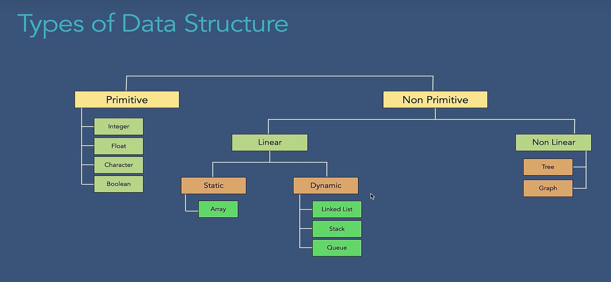

# Data Structures

Data structures are specialized formats for organising, processing, retrieving, and storing data efficiently. They provide a means to manage large amounts of data for various applications, such as databases, operating systems, and networking.

Data Structures are concrete implementations that organize and store data in memory (e.g., ArrayList, LinkedLists, ArrayStack, HashMap). They define how data is physically arranged and accessed.

- ArrayList, LinkedList (implement List ADT)
- ArrayStack, LinkedStack (implement Stack ADT)
- ArrayQueue, LinkedQueue, PriorityQueue (implement Queue ADT)
- HashMap, TreeMap, Hashtable (implement Map ADT)

Abstract Data Types (ADTs) are theoretical models that define what operations can be performed on data and their behavior, without specifying how they are implemented (e.g., List, Stack, Queue as concepts).

- List (supports add, remove, get, etc.)
- Stack (supports push, pop, peek)
- Queue (supports enqueue, dequeue, front)
- Map (supports put, get, remove)
