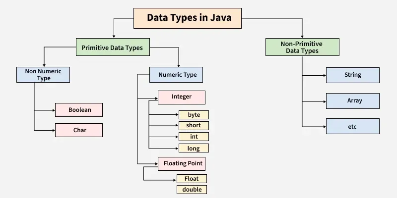

# Data Types


## Primitive Data Types

Primitive data types are the most basic data types available in Java.  
They are predefined by the language and have a fixed size and type.  
These types do not have methods associated with them, and their values are stored directly in memory.

| Type      | Description   | Size (bits) | Range                                 | Example                     |
| --------- |---------------| ----------- | ------------------------------------- | --------------------------- |
| `byte`    | 8-bit signed two's complement integer              | 8           | -2<sup>7</sup> to 2<sup>7</sup>-1     | `byte myByte = 124;`        |
| `short`   | 16-bit signed two's complement integer              | 16          | -2<sup>15</sup> to 2<sup>15</sup>-1   | `short myShort = -100;`     |
| `int`     | 32-bit signed two's complement integer              | 32          | -2<sup>31</sup> to 2<sup>31</sup>-1   | `int myNum = 5;`            |
| `long`    | 64-bit signed two's complement integer              | 64          | -2<sup>63</sup> to 2<sup>63</sup>-1   | `long myLong = -423000L;`   |
| `float`   | single-precision 32-bit IEEE 754 floating-point              | 32          | Approximately ±3.4 x 10<sup>38</sup>  | `float myFloatNum = 5.99f;` |
| `double`  | double-precision 64-bit IEEE 754 floating-point              | 64          | Approximately ±1.7 x 10<sup>308</sup> | `double myDouble = 42.3;`   |
| `char`    | single 16-bit Unicode character              | 16          | 0 to 2<sup>16</sup>-1                 | `char myLetter = 'D';`      |
| `boolean` | logical value | 1           | true or false                         | `boolean myBool = true;`    |

**bit**  
smallest unit of data in a computer - can be `0` or `1`  
8 - bit value -> 00000000 - meaning it can represent 2^8 = 256 combinations

**signed**  
value can be positive or negative  
one bit is used to store the sign  
`0` - positive  
`1` - negative

**two's complement**  
method used to represent and calculate negative numbers  
to find binary for -5
```ruby
5 = 00000101
Invert bits → 11111010
Add 1 → 11111011
=> -5 = 11111011
```
---

### Explanation

- **`int`** is a primitive data type that represents an integer value.
- **`Integer`** is a wrapper class in Java that encapsulates an `int` primitive type, providing additional methods and capabilities.

---

## Non-Primitive Data Types (Objects)

Non-primitive data types are also known as **reference types**. They store memory addresses of objects and have methods associated with them.  
Non-primitive types are defined by the programmer and can be of various types, including classes, arrays, and interfaces.

| Type            | Description                               | Example                                |
| --------------- | ----------------------------------------- | -------------------------------------- |
| `String`        | A sequence of characters                  | `String myText = "Hello";`             |
| `Array`         | A collection of elements of the same type | `int[] myArray = {1, 2, 3};`           |
| Custom Classes  | User-defined types                        | `Person myPerson = new Person();`      |
| Wrapper Classes | Provides methods for primitive types      | `Integer myInt = Integer.valueOf(10);` |

### Examples

- **`String`** is a non-primitive data type, which is actually a class in Java. It is used to store a sequence of characters.
    - Example: `String myText = "Hello";`
- **`Array`** is a non-primitive data type that holds multiple values of the same type in a single structure.
    - Example: `int[] myArray = {1, 2, 3};`

---

### Key Differences between Primitive and Non-Primitive Types

- **Primitive types** have a fixed size and are predefined by Java.
- **Non-primitive types** are created by the programmer and can vary in size.
- **Primitive types** store actual values, while **non-primitive types** store references to objects.
- **Primitive types** stored on the stack and **non-primitive types** stored on the heap