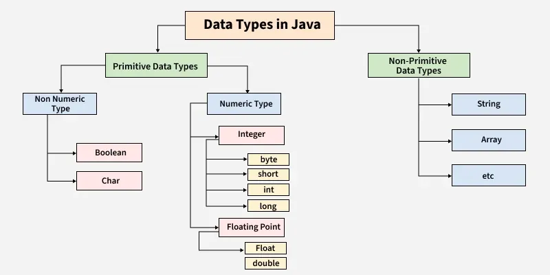

# Data Types


## Primitive Data Types

Primitive data types are the most basic data types available in Java.  
They are predefined by the language and have a fixed size and type.  
These types do not have methods associated with them, and their values are stored directly in memory.

| Type      | Description   | Size (bits) | Range                                 | Example                     |
| --------- |---------------| ----------- | ------------------------------------- | --------------------------- |
| `byte`    | 8-bit signed two's complement integer              | 8           | -2<sup>7</sup> to 2<sup>7</sup>-1     | `byte myByte = 124;`        |
| `short`   | 16-bit signed two's complement integer              | 16          | -2<sup>15</sup> to 2<sup>15</sup>-1   | `short myShort = -100;`     |
| `int`     | 32-bit signed two's complement integer              | 32          | -2<sup>31</sup> to 2<sup>31</sup>-1   | `int myNum = 5;`            |
| `long`    | 64-bit signed two's complement integer              | 64          | -2<sup>63</sup> to 2<sup>63</sup>-1   | `long myLong = -423000L;`   |
| `float`   | single-precision 32-bit IEEE 754 floating-point              | 32          | Approximately ±3.4 x 10<sup>38</sup>  | `float myFloatNum = 5.99f;` |
| `double`  | double-precision 64-bit IEEE 754 floating-point              | 64          | Approximately ±1.7 x 10<sup>308</sup> | `double myDouble = 42.3;`   |
| `char`    | single 16-bit Unicode character              | 16          | 0 to 2<sup>16</sup>-1                 | `char myLetter = 'D';`      |
| `boolean` | logical value | 1           | true or false                         | `boolean myBool = true;`    |

**bit**  
smallest unit of data in a computer - can be `0` or `1`  
8 - bit value -> 00000000 - meaning it can represent 2^8 = 256 combinations

**signed**  
value can be positive or negative  
one bit is used to store the sign  
`0` - positive  
`1` - negative

**two's complement**  
method used to represent and calculate negative numbers  
to find binary for -5
```ruby
5 = 00000101
Invert bits → 11111010
Add 1 → 11111011
=> -5 = 11111011
```
---

### Explanation

- **`int`** is a primitive data type that represents an integer value.
- **`Integer`** is a wrapper class in Java that encapsulates an `int` primitive type, providing additional methods and capabilities.

---

## Non-Primitive Data Types (Objects)

Non-primitive data types are also known as **reference types**. They store memory addresses of objects and have methods associated with them.  
Non-primitive types are defined by the programmer and can be of various types, including classes, arrays, and interfaces.

| Type            | Description                               | Example                                |
| --------------- | ----------------------------------------- | -------------------------------------- |
| `String`        | A sequence of characters                  | `String myText = "Hello";`             |
| `Array`         | A collection of elements of the same type | `int[] myArray = {1, 2, 3};`           |
| Custom Classes  | User-defined types                        | `Person myPerson = new Person();`      |
| Wrapper Classes | Provides methods for primitive types      | `Integer myInt = Integer.valueOf(10);` |

### Examples

- **`String`** is a non-primitive data type, which is actually a class in Java. It is used to store a sequence of characters.
    - Example: `String myText = "Hello";`
- **`Array`** is a non-primitive data type that holds multiple values of the same type in a single structure.
    - Example: `int[] myArray = {1, 2, 3};`

---

### Key Differences between Primitive and Non-Primitive Types

- **Primitive types** have a fixed size and are predefined by Java.
- **Non-primitive types** are created by the programmer and can vary in size.
- **Primitive types** store actual values, while **non-primitive types** store references to objects.
- **Primitive types** stored on the stack and **non-primitive types** stored on the heap

## Special Data Types

### Enums
Enums (short for "enumerations") are a special data type that represents a fixed set of constants.  

Instead of using a collection of `int` or `String` constants, you can define an enum to represent a group of related values in a more type-safe and readable way.

```java
public enum Day {
    SUNDAY,
    MONDAY,
    TUESDAY,
    WEDNESDAY,
    THURSDAY,
    FRIDAY,
    SATURDAY
}
```

In this example, `Day` is an enum that represents the days of the week. Each constant (e.g., `SUNDAY`, `MONDAY`) is an instance of the `Day` enum. Enums provide a way to define a set of named constants, making your code more readable and less error-prone.

```java
if (today == Day.MONDAY) {
    System.out.println("Start of the work week!");
}
```

Enums can also have fields, methods, and constructors, allowing you to associate additional data and behavior with each constant.

```java
public enum OrderStatus {
    PENDING(1),
    SHIPPED(2),
    DELIVERED(3);

    private int code;

    OrderStatus(int code) {
        this.code = code;
    }

    public int getCode() {
        return code;
    }
}
```

```java
OrderStatus status = OrderStatus.SHIPPED;
System.out.println("Order status: " + status); // Output: Order status: SHIPPED
System.out.println("Status code: " + status.getCode()); // Output: Status code: 2
``` 
Use enums when  
- Fixed, known set of values
- States, types or categories
- Replaces constants for better readability and maintainability

## Record
Records are a special type of class in Java that is designed to hold immutable data. They provide a concise syntax for declaring classes that are primarily used to store data, without the need for boilerplate code such as constructors, getters, `equals()`, `hashCode()`, and `toString()` methods, making them ideal for DTOs, API responses, and simple data carriers.

Traditional Class
```java
public class User {
    private final String name;
    private final int age;

    public User(String name, int age) {
        this.name = name;
        this.age = age;
    }

    public String getName() {
        return name;
    }

    public int getAge() {
        return age;
    }

    @Override
    public boolean equals(Object o) {
        if (this == o) return true;
        if (o == null || getClass() != o.getClass()) return false;
        User user = (User) o;
        return age == user.age && Objects.equals(name, user.name);
    }

    @Override
    public int hashCode() {
        return Objects.hash(name, age);
    }

    @Override
    public String toString() {
        return "User{" +
                "name='" + name + '\'' +
                ", age=" + age +
                '}';
    }
}
```

Record Class
```java
public record User(String name, int age) {}
```

In this example, the `User` record automatically generates a constructor, getters, `equals()`, `hashCode()`, and `toString()` methods based on the fields defined in the record declaration. Records are immutable by default, meaning that once an instance is created, its state cannot be changed.

Important to note:
- Records are implicitly `final`, so they cannot be subclassed.
- All fields in a record are implicitly `private` and `final`.
- Records are ideal for simple data carriers, but they are not suitable for complex objects that require mutable state or behavior beyond data storage.
- Records can implement interfaces but cannot extend other classes.

## Optional
`Optional` is a container object that may or may not contain a non-null value. It is used to represent the presence or absence of a value, providing a more expressive way to handle null values and avoid `NullPointerException`.

```java
Optional<String> optionalString = Optional.of("Hello, World!");
if (optionalString.isPresent()) {
    System.out.println(optionalString.get()); // Output: Hello, World!
}
```

In this example, `optionalString` is an `Optional` that contains a non-null value. The `isPresent()` method checks if the value is present, and the `get()` method retrieves the value if it is present.

Empty Optional
```java
Optional<String> emptyOptional = Optional.empty();
if (emptyOptional.isEmpty()) {
    System.out.println("No value present."); // Output: No value present.
}
```

Nullable Optional
```java
Optional<String> nullableOptional = Optional.ofNullable(null);
if (nullableOptional.isEmpty()) {
    System.out.println("No value present."); // Output: No value present.
}
```

`Optional` provides several methods to work with the contained value, such as `orElse()`, `orElseGet()`, and `orElseThrow()`, which allow you to specify default values or throw exceptions when the value is absent.

```java
Optional<String> optionalString = Optional.ofNullable(null);
String result = optionalString.orElse("Default Value");
System.out.println(result); // Output: Default Value

String result2 = optionalString.orElseGet(() -> "Generated Default Value");
System.out.println(result2); // Output: Generated Default Value

try {
    String result3 = optionalString.orElseThrow(() -> new IllegalStateException("Value is absent"));
} catch (IllegalStateException e) {
    System.out.println(e.getMessage()); // Output: Value is absent
}
```

Use `Optional` when:
- A value may be absent (null) and you want to avoid `NullPointerException`.
- You want to provide a more expressive API for handling optional values.
- You want to chain operations on a value that may be absent without having to check for null at each step.

