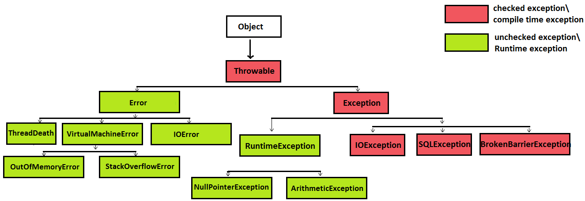

An exception is an unexpected event, which occurs during the execution of a program, that disrupts the expected flow of the program's instructions.

In Java, exceptions are objects that can be thrown by code that encounters an unexpected situation. An exception may also be caught by a surrounding block of code that “handles” the problem in an appropriate fashion.

Some examples of typical conditions where an exception occurs:
* User inputs invalid data
* File requested does not exist in specified file path
* When Java Virtual Machine (JVM) runs out of memory
* Network drops during communication 

### Exception Hierarchy

* **Throwable** is the root class of the exception hierarchy
* **Error** are JVM errors that are generally not recoverable e.g. VirtualMachineError - StackOverflowError
* **Exception** are conditions that the application might want to catch and handle
    * **RuntimeException** - Unchecked exceptions not required to be handled or declared e.g. NullPointerException, ArrayIndexOutOfBoundsException
    * **Checked Exceptions** - Must be handled or declared in method signature e.g. IOException, SQLExceptions otherwise code will not compile

**Errors** - a subclass of Throwable so can be caught but is not advisable as it represents serious issues (usually related to JVM) that should not be caught. Even if caught and handled the application will not be in a stable state. 
* `ThreadDeath` - Thrown when a thread is stopped using Thread.stop() (deprecated and unsafe).
* `VirtualMachineError` - Base class for JVM-related errors (e.g., out of memory, stack overflow). Indicates the JVM itself is broken or exhausted resources.
  * `StackOverflowError` - Thrown when the call stack overflows, typically due to deep or infinite recursion. 
  * `OutOfMemoryError` - JVM cannot allocate memory for an object because the heap is full.

**Exceptions**
* `Exception` - Base class for all exceptions that can be caught. Represent conditions an application might want to handle.
  * `RuntimeException` (Unchecked exception) - Base class for exceptions that occur during runtime due to programming errors.
    - `ArithmeticException` - Thrown when an illegal arithmetic operation occurs (e.g., divide by zero).
    - `ArrayIndexOutOfBoundsException` - Thrown when accessing an array with an invalid index (negative or beyond length).
    - `ClassCastException` - Thrown when trying to cast an object to a subclass/type it is not an instance of.
    - `ConcurrentModificationException` - Thrown when a collection is structurally modified while iterating with an iterator.
    - `IllegalArgumentException` - Thrown when a method receives an invalid or inappropriate argument.
    - `IllegalStateException` - Thrown when a method is invoked at the wrong time/state (e.g., reading from a closed scanner).
    - `IndexOutOfBoundsException` - Thrown when trying to access an index (list, array, string) outside valid range.
    - `NullPointerException` - Thrown when accessing or calling methods/fields on null references.
    - `NumberFormatException` - Thrown when trying to convert a string to a number but the string is not a valid numeric format.
    - `UnsupportedOperationException` - Thrown when an operation is not supported (e.g., modifying an unmodifiable list).
  * Checked Exceptions (Compile Time Exception)
    - `ClassNotFoundException` - Thrown when an application tries to load a class by name but the class cannot be found.
    - `CloneNotSupportedException` - Thrown when an object’s `clone()` method is called but the class does not implement `Cloneable`.
    - `InterruptedException` - Thrown when a thread is interrupted while it is waiting, sleeping, or performing another blocking operation.
    - `IOException` - General I/O failure during reading, writing, or accessing files/streams.
      - `FileNotFoundException` - Thrown when a file cannot be found or opened.
      - `EOFException` - Thrown when the end of a file or stream is reached unexpectedly while reading.
    - `NoSuchMethodException` - Thrown when a requested method cannot be found via reflection.
    - `NoSuchFieldException` - Thrown when a requested field cannot be found via reflection.
    - `SecurityException` - Thrown to indicate a security violation (e.g., denied access by the security manager).
    - `SQLException` - Thrown for database access errors or other SQL-related issues.


**Try-catch blocks**
```java
try {
    Code
} catch (exceptionType variable ) {
    Code
} catch (exceptionType variable) {
    Code
}  
```

```java
public class Main {
    public static void main(String[] args) {
        try {
            int[] numbers = {1, 2, 3};
            int result = numbers[4]; // Trying to access an out-of-bounds index
            System.out.println("Result: " + result); // This line will not be executed
        } catch (ArrayIndexOutOfBoundsException ex) {
            System.out.println("Exception caught: ArrayIndexOutOfBoundsException");
        }
    }
} 
```

---
**Try with resources**
```java
try (BufferedReader br = new BufferedReader(new FileReader("file.txt"))) {
    String line;
    while ((line = br.readLine()) != null) { 
        System.out.println(line);
    }
} catch (IOException e) {
    e.printStackTrace();
}
```

BufferedReader is automatically closed after the try block, even if exception occurs

---
Exceptions throws an exception object so this could be used to throw exception ourselves and specify the expected exception type and handling message & code 
```java
public class Main {
    public static void main(String[] args) { 

        try {
            int result = divide(10, 0); // Division by zero
            System.out.println("Result: " + result); // This line will not be executed
        } catch (Exception ex) {
            System.out.println("Exception caught: " + ex.getMessage());
        }
    } 
    
    public static int divide(int numerator, int denominator) throws Exception {
        if (denominator == 0) {
            throw new Exception("Cannot divide by zero");
        }
        return numerator / denominator;
    }
} 
```
---
You can also have a try block without a catch block but requires a finally block or try with resources. When exception is thrown execution of the try block terminates, the exception is propagated (passed up) to allow the finally block to complete.
```java
try {
    System.out.println("In try block");
    throw new Exception("Exception thrown");
} finally {
    System.out.println("In finally block");
}
```

```bash
In try block
In finally block
Exception in thread "main" java.lang.Exception: Exception thrown
	at org.example.Exceptions.Main.main(Main.java:4)
```
---
**Constructor can throw an exception** 
```java
public MyClass() throws IOException {
  throw new IOException("Constructor Exception");
}
```
---
**Multiple catch block for single try**
```java
try {
    int a = 10 / 0;
} catch (ArithmeticException e) {
    System.out.println("ArithmeticException caught");
} catch (Exception e) {
    System.out.println("General Exception caught"); }
```
---
**Exception from static block**  
When exception is thrown from `static` initialiser block, the JVM catches it and warps in `ExceptionInInitializerError`.
The class will fail to initialise meaning any subsequent attempt to call the class (create an instance, call static method) will result
in `NoClassDefFoundError`. 
```java
public class StaticInitializerExceptionExample {

    public static void main(String[] args) {
        System.out.println("--- First attempt to access the class ---");
        try {
            // This will trigger the static block and cause the error.
            StaticBlockFailure.doSomething();
        } catch (Throwable t) {
            // The original ArithmeticException is wrapped in an ExceptionInInitializerError.
            System.err.println("Caught during first attempt: " + t);
            System.err.println("Original cause: " + t.getCause());
        }

        System.out.println("\n--- Second attempt to access the class ---");
        try {
            // The class is already marked as failed, so we get a different error.
            StaticBlockFailure.doSomething();
        } catch (Throwable t) {
            // This time, we get NoClassDefFoundError.
            System.err.println("Caught during second attempt: " + t);
        }
    }
}

class StaticBlockFailure {
    // This static block will run when the class is first initialized.
    static {
        System.out.println("Initializing StaticBlockFailure class...");
        int result = 10 / 0; // This will throw an ArithmeticException.
    }

    public static void doSomething() {
        System.out.println("This method will never be called.");
    }
}
```

```bash
--- First attempt to access the class ---
Initializing StaticBlockFailure class...
Caught during first attempt: java.lang.ExceptionInInitializerError
Original cause: java.lang.ArithmeticException: / by zero

--- Second attempt to access the class ---
Caught during second attempt: java.lang.NoClassDefFoundError: Could not initialize class StaticBlockFailure
```

---
**`NullPointerException`** -  an unchecked exception that occurs when an
application attempts to use null in a case where an object is required. This
includes calling a method on a null object, accessing or modifying a field of
a null object, or taking the length of null as if it were an array.

Avoid by:
* Null Checks: Always check for null before accessing an object’s methods
   or properties.
  ```java
    if (user != null && user.getName() != null) {
        log.info("User name: " + user.getName());
    }
  ```
* Optional Class: Use Optional (introduced in Java 8) to handle potentially
   null values without risking a NullPointerException.
  ```java
    if (id == 1) {
        return Optional.of("Alice"); // Value is present
    } else {
        return Optional.empty(); // Value is absent
    }
  ```
  
  ```java
  userName.isPresent();
  userName.orElse("Default Name");
  userName.orElseThrow(() -> new IllegalArgumentException("User with ID " + id + " not found."));
  userName.ifPresent(name -> System.out.println("User name (ifPresent): " + name));
  ```
* Default Values: Provide default values to avoid returning null 
  ```java
  return (value != null) ? value : "default_value";
  ```
* Avoiding null Assignments: Prefer using empty objects, empty collections,
   or special "no-value" objects instead of null.
  ```java
    if (noUsersFound) {
        return Collections.emptyList(); // Better than returning null
    }
    return activeUsers;
  ```
* Compile - Time Annotations (Lombok's `@NonNull`): Generate null checks at compile time and can enforce checks earlier
  ```java
    public void process(@NonNull User user) {
      // If 'user' is null when this method is called, Lombok will inject
      // a null check at the beginning of the method and throw a NullPointerException.
      System.out.println("Processing user: " + user.getName());
    }
  ```
---
**`finally` block**  
This block cannot be skipped and will execute after the try - catch blocks even if exception is thrown.
The block might not execute if: 
* JVM crashes or exits early `(System.exit(0))`
* Thread executing finally block is interrupted or killed
* Code enters an infinite loop


---
**`OutOfMemoryError`**
* Heap Dump Analysis: Analyze heap dumps using tools like Eclipse MAT
   or VisualVM to find memory leaks. 
* Memory Usage Patterns: Check memory usage patterns and garbage
   collection logs for unusual behavior. 
* Code Review: Review code for potential leaks or inefficient memory
   usage. 
* Increase Heap Size: Temporarily increase heap size to confirm if it's a
   memory-related issue.
---
**Custom Exceptions**
```java
public class CustomCheckedException extends Exception {
    public CustomCheckedException(String message) {
        super(message);
    }
}
```

```java
public CustomUncheckedException extends RuntimeException {
    public CustomUncheckedException(String message) {
        super(message);
  }
}
```
---
### Exception Chaining

**Benefits of Exception Chaining**

- Preserves Root Cause: Helps in debugging by retaining the original exception that triggered the failure.
- Improves Logging and Diagnostics: Logs can show a full stack trace of both the wrapper and the original exception.
- Encapsulation: Allows higher-level methods to throw domain-specific exceptions while still retaining low-level details.
- Consistency: Makes exception handling more structured and predictable.

**Drawbacks of Exception Chaining**

- Overhead in Stack Traces: Can lead to long and complex stack traces, making logs harder to read.
- Misuse: If not used carefully, it can obscure the real cause (e.g., chaining unrelated exceptions).
- Redundancy: Sometimes the chained exception doesn't add much value and just clutters the output.
- Performance: Slightly more memory and CPU usage due to nested exception objects.