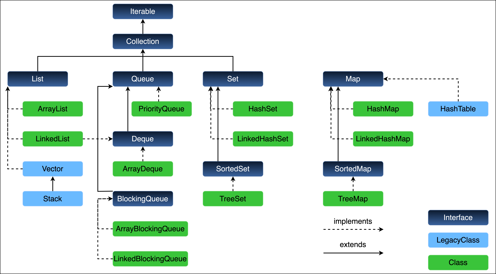
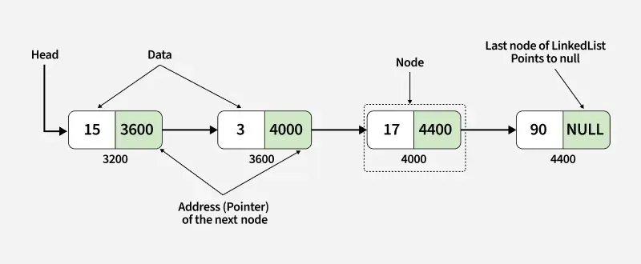

The Collections framework provides a set of interfaces, implementations and utilities in `java.util` 
for storing, retrieving and manipulating groups of objects through standard data structures (list, sets, maps, queues), 
algorithms (sort, shuffle) and interoperability (iterators, streams)


---
# `Iterable<T>`
The root interface for anything that can be iterated (looped over).
`Iterator<T> iterator();` - provides an `Iterator` to traverse elements.

(Java 8+) `forEach(Consumer<? super T> action);` - perform action on each element.

(Java 8+) `Spliterator<T> spliterator();` - used in streams & parallel iteration.

Any class that implements `Iterable` can be used in a for-each loop. Only promises that you can loop through elements
but does not say how elements are stored, added, removed etc. 

`Iterable` is general purpose (can iterate over a sequence of any type) so uses the generic type `T` (Type).
`Iterable<String>` then `T` = `String`. 

---
# `Collection<E>`
The root interface of the Collections Framework and extends `Iterable<E>`.  
Defines the basic operations for a group of Objects(elements):
* `boolean add(E e)`
* `boolean remove(Object o)`
* `boolean contains(Object o)`
* `int size()`
* `boolean isEmpty()`
* `void clear()`
* `Object[] toArray()`
* `containsAll(Collection<?> c)`
* `boolean addAll(Collection<? extends E> c)`
* `boolean removeAll(Collection<?> c)`
* `void clear()`

All list, sets and queues implement `Collection`.  

`Collection` represents a group of elements therefore `Collection<E>` stores elements of type `E`.  
`Collection<Integer>` then `E` = `Integer` meaning collection stores elements of type `Integer`. 
---
## `List<E>`
An ordered collection (sequence) of elements

* Maintains insertion order 
* Allows duplicate elements 
* Supports positional access via index 
* Important methods:
  * `get(int index)`
  * `set(int index, E element)`
  * `indexOf(Object o)`
  * `lastIndexOf(Object o)`
  * `subList(int from, int to)`
---
### `ArrayList<E>`
A resizable-array implementation of `List`, used best for random access operations such as fast lookups 
and fewer inserts/deletes in the middle. Elements are stored contiguously (connected without a break) in memory. 

* `get(int index)` → `O(1)`
* `set(int index, E e)` → `O(1)`
* `add(E e)` → Amortized `O(1)`
* `remove(int index)` → `O(n)` 
  * Best Case: remove last element = no shift needed = `O(1)`
  * Worst Case: remove first element = shift all `n-1` elements to left = `O(n)`
  * Average: `n/2` shifts -> `O(n)` (drop constants to simplify in Big - O)
---
### `LinkedList<E>`
A doubly-linked (each node has 2 references previous & next) list implementation of `List` (also `Deque`) used best for frequent insertions and deletions.  
Each node has reference to its previous and next node. Elements are not stored contiguously making it great for inserts / deletions 
but not for random access. 

* `get(int index)` → `O(n)` - to access element at index `i`, must traverse node by node till index `i` is reached then need to update pointers (prev/next)
* `add/remove at ends` → `O(1)` - directly access head (first) or tail (last) node reference with no bulk shifting like `ArrayList`
* `add/remove in middle` → `O(n/2)` → `O(n)`


where tail pointer references last node

### `ArrayList<E>` vs `LinkedList<E>`
| Operation              | `ArrayList`        | `LinkedList`                           |
| ---------------------- | ------------------ | -------------------------------------- |
| `get(int index)`       | **`O(1)`**           | **`O(n)`**                               |
| `add/remove at end`    | Amortized **`O(1)`** | **`O(1)`**                               |
| `add/remove in middle` | **`O(n)`**           | **`O(n)`**                               |
| Memory overhead        | Low (array)        | Higher (extra node objects + pointers) |

* Use `ArrayList` when you need fast random access and fewer insertions / deletions
* Use `LinkedList` when you need lots of insertions / deletions at ends
---
### `Vector<E>`
Is a dynamic array, part of the legacy collection classes. It grows automatically as elements are added similar to `ArrayList`.  
It is synchronized, meaning thread-safe (only one thread can modify at a time) but slower than `ArrayList` in single - threaded contexts.

```java
Vector<String> vector = new Vector<>();

vector.add("Apple");
vector.add("Banana");
vector.add("Cherry");

System.out.println(vector.get(1)); // Banana
vector.remove("Banana");
```
---
### `Stack`
Is a sublcass of `Vector` that represents a **Last - In - First - Out (LIFO)** data structure.  

Every push adds to the top of the stack, every pop removes the top element of the stack (like a stack of plates).

Inherits `Vector`'s synchronized behaviour. Uses the end of the vector as the stack top.

Vector with below array
```text
Index:   0   1    2    3
Data:   [10, 20, 30, 40]
```

Top of the stack is index 3 -> 40 and operations only manipulate the top (or last element in `Vector`)

`push(50)` → adds 50 at the end (index 4)

`pop()` → removes from the end

`peek()` → reads the end element without removing it

```java
Stack<Integer> stack = new Stack<>();
```

* `push(E e)` - `O(1)` - Pushes element on top of the stack with no shifting
* `pop()` - `O(1)` - Removes and returns the element at the top of the stack
* `peek()` - `O(1)` - Returns the element at the top of the stack without removing it
* `search(Object o)` - `O(n)` - Returns 1-based position from top, or -1 if not found via a linear scan

`search(Object o)` - searches the stack of the specified element `o`, if the element exists then it returns the
position counted from the top of the stack, starting at 1. If the element doesn't exist then returns -1. 

So topmost element is position 1, second element from top position 2.

---
## `Queue`
Is a First - In - First - Out (FIFO) data structure where elements are added at the tail and removed from the head. First
element added is the first one to be removed similar to people waiting in a queue. 

```java
Queue<String> queue = new LinkedList<>();
```

LinkedList implements both the List and the Deque(Queue) interfaces.
It can behave as both a list and a queue, depending on how you use it

*  `add(E e)` -	Inserts element; throws exception if full
*  `offer(E e)` - Inserts element; returns false if full (safe alternative)
*  `remove()` -	Removes and returns head; throws exception if empty
*  `poll()` - Removes and returns head; returns null if empty
*  `element()` - Returns head; throws exception if empty
*  `peek()` - Returns head; returns null if empty

---
### `PriorityQueue`
A `Queue` that orders elements by priority not insertion order. Uses natural ordering (`Comparable`) or custom `Comparator`.  
Internally implemented as a binary heap.

The head of the queue is the smallest (or highest priority) element.  

Does not guarantee ordering of all elements when iterating (for - loop) as you're going through an internal heap array not a sorted `List`.  

`null` elements are not allowed. 

* `offer(E e)` - `O(log n)`	- Element added at end, then “heapified up” (may bubble up through levels).
* `poll()` - `O(log n)`	- Root removed, last element moved to top, then “heapified down.”
* `peek()` - `O(1)`	- Root is always at index 0.
* `remove(Object o)` - `O(n)` - Must search entire heap array for object first.
* c`ontains(Object o)` - `O(n)`	- Linear search through heap array.

Natural Ordering
```java
PriorityQueue<Integer> pq = new PriorityQueue<>();

pq.offer(30);
pq.offer(10);
pq.offer(20);

System.out.println(pq.poll()); // 10 (smallest)
System.out.println(pq);        // [20, 30]
```

Custom Comparator
```java
PriorityQueue<Integer> pq = new PriorityQueue<>(Comparator.reverseOrder());

pq.offer(10);
pq.offer(20);
pq.offer(5);

System.out.println(pq.poll()); // 20 (largest)
```
---

### `Deque`
A Double - Ended Queue that allows insertion and removal from both ends.
* `addFirst(E e)` - `O(1)` -	Inserts at head
* `addLast(E e)` - `O(1)` -	Inserts at tail
* `offerFirst(E e)` - Safe insert at head
* `offerLast(E e)` - Safe insert at tail
* `removeFirst()` - `O(1)` - `O(1)` - Removes from head
* `removeLast()` - `O(1)` - Removes from tail
* `peekFirst()` - `O(1)` - Returns head
* `peekLast()` - `O(1)` - Returns tail

```java
Deque<String> deque = new LinkedList<>();

deque.addFirst("A");
deque.addLast("B");
deque.addLast("C");

System.out.println(deque);       // [A, B, C]
System.out.println(deque.removeLast()); // removes C
System.out.println(deque);       // [A, B]
```
--- 
### `ArrayDeque`
A resizable array based implementation of `Deque` which is faster than `LinkedList` for stack and queue operations. 

Not synchronized (not thread-safe) and doesn't allow null elements

As Queue
```java
Deque<String> queue = new ArrayDeque<>();
queue.offer("A");
queue.offer("B");
queue.offer("C");

System.out.println(queue.poll()); // removes A
System.out.println(queue);        // [B, C]
```

As Stack
```java
Deque<Integer> stack = new ArrayDeque<>();
stack.push(10);
stack.push(20);
stack.push(30);

System.out.println(stack.pop()); // 30
System.out.println(stack.peek()); // 20
```
---
### `BlockingQueue`
A thread - safe queue used in concurrent programming. 

Supports blocking operations:
* Waits when adding to a full queue
* Waits when removing from an empty queue

---
| Feature     | Queue        | PriorityQueue       | Deque                   | ArrayDeque                 | BlockingQueue                    |
| ----------- | ------------ | ------------------- | ----------------------- | -------------------------- | -------------------------------- |
| Ordering    | FIFO         | By priority         | FIFO + LIFO             | FIFO + LIFO                | FIFO                             |
| Thread-safe | ❌            | ❌                   | ❌                       | ❌                          | ✅                                |
| Allows null | ✅            | ❌                   | ❌                       | ❌                          | ❌                                |
| Backed by   | LinkedList   | Binary heap         | LinkedList / ArrayDeque | Array                      | Varies                           |
| Common use  | Simple queue | Priority scheduling | Both stack/queue        | Fast general-purpose queue | Multi-threaded producer-consumer |

---
## `Map`

### `HashMap`
A `HashMap` in Java is a data structure that implements the `Map` interface, providing a way to store key-value pairs. 
It uses a hash table to store the map's entries, allowing for fast retrieval, insertion, and deletion operations.

In a `HashMap`, the `hashCode()` method generates an integer hash code for each key, which is used to determine the bucket (a slot in the hash table) where the key-value pair is stored, allowing for efficient retrieval, insertion, and deletion operations.

Use `.get()` then perform a null check rather than `containsKey` then `get`.
`Map` doesn't extend or implement the `Collection` interface.

```java
import java.util.HashMap;
import java.util.Set;

final Map<Integer, Product> idToProduct = new HashMap<>(); // Initialise & Declare
idToProduct.put(1, new Product(1, "Product 1"));
idToProduct.put(2, new Product(2, "Product 2"));

Set<Integer> ids = idToProduct.keySet();
```

```java
import java.util.Collection;

Collection<Product> products = idToProduct.values();
```

```java
Set<Map.Entry<Integer, Product>> entries = idToProduct.entrySet(); 
for(Map.Entry<Integer, Product> entry : entries){
    System.out.println(entry.getKey() + " : " + entry.getValue());
}
// Map.Entry is a nested interface of Map

// From Java 10
var entries = idToProduct.entrySet();
```

```java
// Initialise & Declare 

HashMap<KeyType, ValueType> map = new HashMap<>();

HashMap<String, Integer> map = new HashMap<>(); 


map.put(key1, value1); // Adding elements to the HashMap 

ValueType value = map.get(key); // Retrieving values based on keys 


// Checking if the HashMap contains a specific key or value 

boolean containsKey = map.containsKey(key);

boolean containsValue = map.containsValue(value);

ValueType removedValue = map.remove(key); // Removing an entry from the HashMap 

boolean isEmpty = map.isEmpty(); // Checking if the HashMap is empty 

int size = map.size(); // Getting the size of the HashMap 

map.clear(); // Clearing the HashMap (removing all entries) 

Set<KeyType> keySet = map.keySet(); // Getting a Set of keys in the HashMap  

Collection<ValueType> values = map.values(); // Getting a Collection of values in the HashMap


// Iterating over the entries in the HashMap using a for-each loop 

for (Map.Entry<KeyType, ValueType> entry : map.entrySet()) {
    KeyType key = entry.getKey(); 

    ValueType value = entry.getValue(); 

    // Perform operations on key-value pairs 

}

`map.put()` // puts a key-value pair in the map, returns the old value or null if the key was not present

`map.replace()` // replaces the value of a key if the key is present, returns the old value or null if the key was not present

`map.replaceAll((id,product) -> new Product(id,product.getName(),product.getWeight() + 10))` // replaces all values in the map, returns void

`map.remove()` // removes a key if it is present, returns the value associated with the key or null if the key was not present

`map.getOrDefault()` // returns a default value if the key is not found, otherwise returns the value associated with the key

`map.computeIfAbsent(key, id -> new Product(id,"Name",5))` // computes and returns a value if the key is not found, otherwise returns the existing value

`map.putIfAbsent()` // puts a value if the key is not found, returns the existing value or null if the key was not present

`map.compute()` // computes and returns a value if the key is found, otherwise returns null

`map.merge()` // merges the value with the existing value if the key is found, returns the new value associated with the key

`map.forEach((id,product)) -> { System.out.println(id + " : " + product.getName()); }`// performs an action on each entry, returns void
```

### Empty Collections
When you want to pass no values to a method that expects a collection.
```java
import java.util.Collections;
import java.util.Set;

List<String> list = Collections.emptyList();
Map<Integer, String> map = Collections.emptyMap();
Set<Integer> set = Collections.emptySet();
```
### Collection Factories

```java
import java.util.Map;

List<String> list = List.of("A", "B", "C");

Map<String, Integer> map = Map.of("A", 1, "B", 2, "C", 3);

Map<String, Integer> map = Map.ofEntries(
        Map.entry("A", 1),
        Map.entry("B", 2),
        Map.entry("C", 3)
);
```

### Collection Operations

```java
import java.util.Collection;
import java.util.Collections;

Product lightestProduct = Collection.min(products, Product.BY_WEIGHT);
Product heaviestProduct = Collection.max(products, Product.BY_WEIGHT);

Collections.shuffle(products);
```

### `HashSet`
A `HashSet` in Java is a data structure that implements the `Set` interface, providing a way to store unique elements. It uses a hash table to store the set's elements only once without duplication, allowing for fast insertion, deletion, and lookup operations.

```java
Set<Product> products = new HashSet<>();
```
