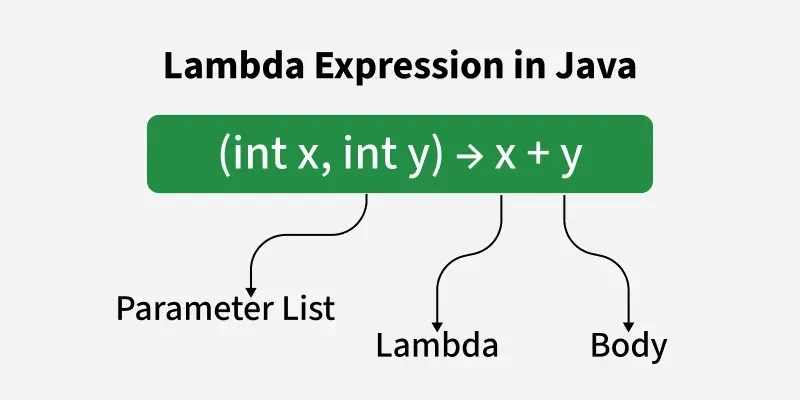

# Functional Interfaces

A **functional interface** in Java is an interface that contains exactly one abstract method but can have multiple default or static methods. They are used as the basis for lambda expressions and method references, allowing for a more functional programming style in Java.

```java
new Thread(() -> {
    System.out.println("Hello from a thread!");
}).start();
```

In this example, `Runnable` is a functional interface because it has a single abstract method `run()`. The lambda expression `() -> { System.out.println("Hello from a thread!"); }` provides the implementation for the `run()` method.

`@FunctionalInterface` annotation can be used to indicate that an interface is intended to be a functional interface. This annotation is optional but helps to catch errors at compile time if the interface does not meet the criteria of a functional interface.

```java
@FunctionalInterface
interface Square {
    int calculate(int x);
}
```

```java
Square square = (int x) -> x * x; // Lambda expression implementing the calculate method taking x as input and returning x * x
System.out.println(square.calculate(5)); // Outputs: 25
```

In this example, the `Square` interface is a functional interface with a single abstract method `calculate(int x)`. The lambda expression `(int x) -> x * x` provides the implementation for this method, taking an integer `x` as input and returning its square.

## Type of Functional Interfaces

### Supplier

does not take in an argument and returns any type of value

```java
public interface Supplier<T> {
    T get(); // Abstract method with no parameter returning a value of generic type
}


Supplier<String> stringSupplier = () -> "Hello, World!";
System.out.println(stringSupplier.get()); // Outputs: Hello, World!
```

where T is the generic type parameter.

### Consumer

takes in only one argument of any type and returns void

```java
public interface Consumer<T> {
    void accept(T t); // Abstract method with 1 parameter returning void
}

Consumer<String> consumer = s -> System.out.println(s);

System.out.println(consumer.accept("Hello")); // Outputs: Hello!
```

### Predicate

takes in only one argument of any type and returns a boolean

```java
public interface Predicate<T> {
    boolean test(T t); // Abstract method with 1 parameter returning a boolean
}

Predicate<String> isEmpty = s -> s.isEmpty();
System.out.println(isEmpty.test("")); // Outputs: true
```

### Function

takes in an argument of one type and returns a value of another type

```java
public interface Function<T, R> {
    R apply(T t); // Abstract method with 1 parameter returning a value of generic type
}

Function<User, String> getName = user -> user.getName();
```

where T is the input type and R is the output type.

### Runnable

does not take in an argument and returns void

```java
public interface Runnable {
    void run(); // Abstract method with no parameter returning void
}

Runnable runnable = () -> System.out.println("Hello, World!");
runnable.run(); // Outputs: Hello, World!
```

**Example**

```java
List<String> strings = new ArrayList<>(List.of("A", "B", "C", "D", "E"));

Predicate<String> filter = string -> string.startsWith("A");
strings.removeIf(filter);
strings.removeIf(string -> string.startsWith("A")); // Inline

Consumer<String> action = string -> System.out.println(string);
strings.forEach(action);
strings.forEach(string -> System.out.println(string)); // Inline

```

### Comparator

```java
Comparator<Product> byWeight = (product1, product2) -> product1.getWeight() - product2.getWeight();
List<Product> products = new ArrayList<>(List.of(new Product("A", 10), new Product("B", 20), new Product("C", 30)));
products.sort(byWeight);
```

## Lambda Expressions

Lambda expressions are a feature introduced in Java 8 that allows you to write concise and expressive code by defining anonymous functions. Lambda expressions are used to implement functional interfaces, which are interfaces with a single abstract method (SAM). Lambda expressions provide a way to pass code as an argument to a method, making your code more flexible and modular by avoiding the need for creating separate classes for simple operations.



- Parameter List: Parameters for the lambda expression
- Arrow Token: `->` separates the parameter list from the body of the lambda expression
- Body: The code to be executed when the lambda expression is invoked

Lambda expressions can accept any number of parameters (including zero) and can return a value or be void. They require a functional interface with a matching method signature with the same number and type of parameters.

## Method References

Method references provide a way to refer to methods without executing them. They are a shorthand notation of a lambda expression to call a method. Method references can be used wherever a functional interface is expected.

```java
public class AClass {
    public static void printName(String name) {
        System.out.println(name);
    }

    public static void main(String[] args) {
        List<String> names = Arrays.asList("Alice", "Bob", "Charlie");
        names.forEach(AClass::printName);
    }
}
```

In this example, `AClass::printName` is a method reference that refers to the static `printName` method of the `AClass` class. It is equivalent to the lambda expression `name -> AClass.printName(name)`.

- Improves code readability by reducing boilerplate code
- Can refer to static methods, instance methods, and constructors
- Reuses existing methods without needing to rewrite them in lambda expressions
- Supports functional programming paradigms in Java

### Types of Method References

**Static Method Reference**  
Shorter way to refer to a static method than using a lambda expression

```java
// Lambda expression
(args) -> ClassName.staticMethodName(args)

// Method reference
ClassName::staticMethodName
```

```java
// Static method
public class Utils {
    public static void print(String s) {
        System.out.println(s);
    }
}

// Usage
List<String> list = Arrays.asList("A", "B", "C");
list.forEach(Utils::print); // Equivalent to s -> Utils.print(s)
```

**Instance Method Reference of a Particular Object**  
Using a method from a specific instance of a class without needing to write a lambda expression

```java
// Lambda expression
(args) -> instance.methodName(args)

// Method reference
instance::methodName
```

```java
public class Printer {
    public void print(String s) {
        System.out.println(s);
    }
}

Printer printer = new Printer();
List<String> list = Arrays.asList("A", "B", "C");
list.forEach(printer::print); // Equivalent to s -> printer.print(s)
```

**Instance Method Reference of an Arbitrary Object of a Particular Type**  
Calling an instance method on objects of a specific type without writing a lambda expression

```java
// Lambda expression
(obj, args) -> obj.methodName(args)

// Method reference
ClassName::methodName
```

```java
List<String> list = Arrays.asList("a", "b", "c");
list.forEach(String::toUpperCase); // Equivalent to s -> s.toUpperCase()
// Note: This does not print, but returns the uppercase string. For printing:
list.forEach(System.out::println); // Equivalent to s -> System.out.println(s)
```

**Constructor Reference**  
Creates a new instance of a class using its constructor without writing a lambda expression

```java
// Lambda expression
(args) -> new ClassName(args)

// Constructor reference
ClassName::new
```

```java
// Constructor reference for creating objects
Supplier<ArrayList<String>> supplier = ArrayList::new;
ArrayList<String> newList = supplier.get(); // Equivalent to () -> new ArrayList<>()
```
