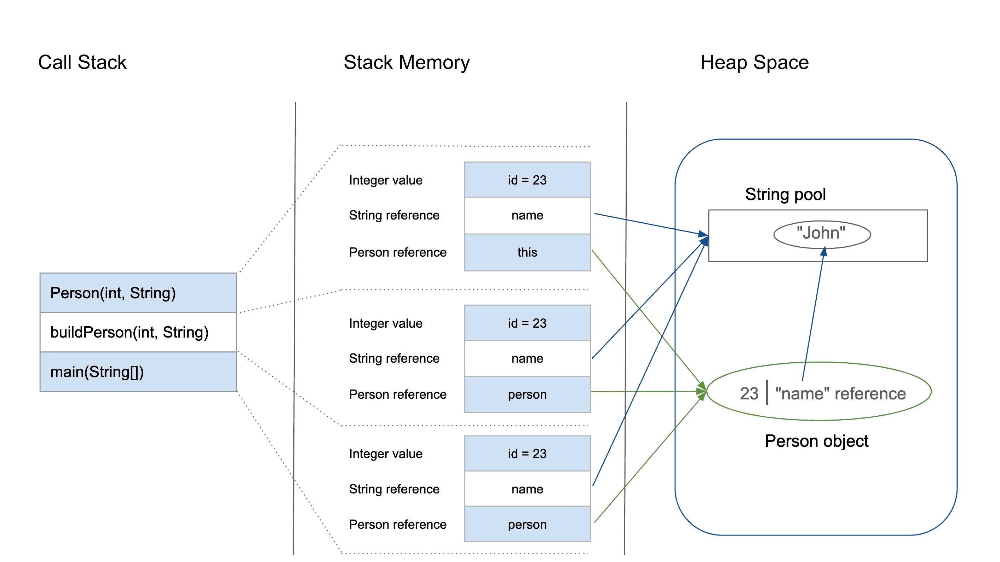

# Java Memory Management
Is the process by which the Java Virtual Machine (JVM) automatically handles the allocation and reallocation of memory.
It uses a garbage collector to reclaim memory by removing unused objects, eliminating the need for manual memory management.

## JVM Memory Structure
Defines various runtime data areas used during the execution of a program. Some created by JVM, and others created by threads
used in a program. Memory areas created by JVM are only destroyed when the JVM exits, likewise with threads.

Memory Areas:
* Heap Area
* Method Area
* JVM Stacks
* Native Method Stacks
* Program Counter (PC) Registers

**Heap Area**  
* The main shared runtime data area where all Java objects and arrays are stored.
* Used for instance variables (fields belonging to an object), arrays and class instances (object)
* Shared among all threads and created when the JVM starts
* Only one heap for a running JVM process
* Managed by the Garbage Collector (GC)

**Method Area** / Metaspace in modern JVMs
* Where class - level data is stored - not individual objects
* Used for class metadata(class name, methods, fields), static variables, constant pool, method and constructor bytecode
* Shared among all threads and is a separate memory region grouped with the heap

**JVM stacks**  
* Each thread has its own JVM Stack for method execution
* Used for primitive values, method frames (local variables, method arguments, return values) and references to objects in the heap
* One per thread and not shared, created when a thread is created
* Access to this memory is Last - In - First - Out (LIFO)
* When a new method is called, a new block is created on top of the stack, which contains values specific to that method
* Once a method completes execution, the stack is removed automatically and flow goes back to the calling method, making space for next method

**Native Method Stacks**  
* Similar to JVM stack but used when Java code calls native (non - Java) code
* Used for storing native method information and execution state that interact with Java code
* One per thread

**Program Counter (PC) Registers**
* Small memory area that keeps track of the address of the currently executing instruction in a thread
* Used for keeping track of the next bytecode instruction to execute by the JVM
* One PC register per thread
* Not part of the heap or stack, a very small memory area per thread used by JVM to manage execution flow

**Garbage Collector**
It automatically removes unused objects from the heap that are no longer needed.

```java
class Person {
    int id;
    String name;

    public Person(int id, String name) {
        this.id = id;
        this.name = name;
    }
}

public class PersonBuilder {
    private static Person buildPerson(int id, String name) {
        return new Person(id, name);
    }

    public static void main(String[] args) {
        int id = 23;
        String name = "John";
        Person person = null;
        person = buildPerson(id, name);
    }
}
```

1. `main()`, space in stack memory created to store primitive (`id`) and references to objects (reference of `Person` is initially pointing to `null` ) made in this method  

    ```
    Stack Memory:
    | main() stack frame |
    ```
    | Variable | Type                 | Memory Location | Value                                 |
    | -------- | -------------------- | --------------- | ------------------------------------- |
    | `id`     | primitive `int`      | stack           | 23                                    |
    | `name`   | reference (`String`) | stack           | → points to `"John"` (in String Pool) |
    | `person` | reference (`Person`) | stack           | null                                  |
    
    **Heap**

    | Object   | Location           | Content  |
    | -------- | ------------------ | -------- |
    | `"John"` | String Pool (Heap) | `"John"` |

2. static method `buildPerson()` called within `main()` creating new stack frame on top of `main` frame

    ```
    Stack Memory:
    | buildPerson() frame |
    | main() frame        |
    ```
    | Variable | Type      | Memory Location | Value                        |
    | -------- | --------- | --------------- | ---------------------------- |
    | `id`     | primitive | stack           | 23                           |
    | `name`   | reference | stack           | → points to `"John"` in heap |
3. Insider `buildPerson()` -> new `Person(id, name)`, the `new` keyword triggers heap allocation for a new `Person` object. 
The constructor call creates another temporary stack frame for `Person(int, String)`

    ```
    Stack Memory:
    | Person() constructor frame |
    | buildPerson() frame        |
    | main() frame               |
    ```
    | Variable | Type      | Memory Location | Value                              |
    | -------- | --------- | --------------- | ---------------------------------- |
    | `this`   | reference | stack           | → points to new Person in heap     |
    | `id`     | primitive | stack           | 23                                 |
    | `name`   | reference | stack           | → points to `"John"` (heap string) |
4. New `Person` object created in heap

   | Object         | Type     | Content                      |
   | -------------- | -------- | ---------------------------- |
   | `Person@0x123` | `Person` | `{ id = 23, name → "John" }` |
   | `"John"`       | `String` | "John"                       |

5. Construction of `Person` completed so constructor stack frame pops off the stack
    ```
    Stack Memory:
    | buildPerson() frame        |
    | main() frame               |
    ```
6. Return to `buildPerson()`, constructor returns the reference to the newly created `Person` object in heap, 
passed back to `buildPerson()` which passes back to `main`. `buildPerson` now pops off the stack
    ```
    Stack Memory:
    | main() frame               |
    ```
7. In `main()`, after `person = buildPerson(id, name)`

   | Variable | Type      | Value                   |
   | -------- | --------- | ----------------------- |
   | `person` | reference | → `Person@0x123` (heap) |

Final stack

```
| main() stack frame |
|  id = 23           |
|  name → "John"     |
|  person → Person@0x123 |
```

Final heap

```text
Person@0x123 → {
    id = 23,
    name → "John"
}

String Pool:
"John"

```
