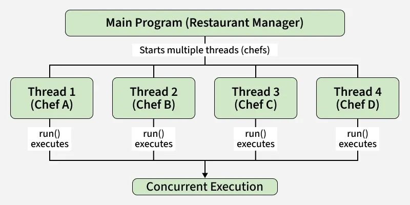

# Multithreading

Is a programming technique that allows multiple threads (smaller units of a process) to run concurrently within a single program on a single CPU by default. This enables Java applications to perform multiple tasks simultaneously, improving efficiency and responsiveness.

It can be parallel (on multi-core processors) or interleaved (on single-core processors) depending on the system's capabilities and the JVM's thread scheduling.

**Thread** is the smallest unit of processing that can be scheduled by the operating system. In Java, the `Thread` class represents a thread of execution in a program. Each thread has its own call stack, local variables, and program counter.

**Concurrency** is the ability of a program to execute multiple tasks in overlapping time periods, while **Parallelism** is the ability to execute multiple tasks simultaneously on multiple processors or cores.



## Creating Threads

There are two main ways to create threads in Java:

1. **Extending the `Thread` class**: You can create a new class that extends the `Thread` class and overrides its `run()` method.

```java
class CookingTask extends Thread {
    private String task;

    CookingTask(String task) {
        this.task = task;
    }

    public void run() {
        System.out.println(task + " is being prepared by " +
            Thread.currentThread().getName());
    }
}

public class Restaurant {
    public static void main(String[] args) {
        Thread t1 = new CookingTask("Pasta");
        Thread t2 = new CookingTask("Salad");
        Thread t3 = new CookingTask("Dessert");
        Thread t4 = new CookingTask("Rice");

        t1.start();
        t2.start();
        t3.start();
        t4.start();
    }
}
```

`start()` method is called to begin the thread's execution, which in turn calls the overridden `run()` method.

2. **Implementing the `Runnable` interface**: You can create a class that implements the `Runnable` interface and provides an implementation for the `run()` method. Then, you can create a `Thread` object and pass an instance of your class to it.

```java
class CookingJob implements Runnable {
    private String task;

    CookingJob(String task) {
        this.task = task;
    }

    public void run() {
        System.out.println(task + " is being prepared by " +
            Thread.currentThread().getName());
    }
}

public class RestaurantRunnable {
    public static void main(String[] args) {
        Thread t1 = new Thread(new CookingJob("Soup"));
        Thread t2 = new Thread(new CookingJob("Pizza"));
        Thread t3 = new Thread(new CookingJob("Burger"));

        t1.start();
        t2.start();
        t3.start();
    }
}
```

Use `extends Thread` if your class does not already extend another class. Use `implements Runnable` if your class already extends another class, as Java supports only single inheritance.

Advantages of Multithreading:

- Improved Performance: Multiple tasks can run simultaneously, reducing execution time.
- Efficient CPU Utilization: Threads keep the CPU busy by running tasks in parallel.
- Responsiveness: Applications (like GUIs) remain responsive while performing background tasks.
- Resource Sharing: Threads within the same process share memory and resources, avoiding duplication.
- Better User Experience: Smooth execution of tasks like file downloads, animations, and real-time updates.

Life cycle of a thread:

- New: A thread is created but not yet started.
- Runnable: The thread is ready to run and waiting for CPU time.
- Running: The thread is currently executing its `run()` method.
- Waiting / Blocked: The thread is waiting for a resource (like I/O) to become available.
- Terminated: The thread has completed its execution or has been stopped.

Use `start()` to begin a thread's execution, which calls the `run()` method internally. Do not call `run()` directly, as it will not create a new thread.

## `sleep()`

`Thread.sleep(milliseconds)` is a static method that pauses the execution of the current thread for the specified duration in milliseconds. It throws `InterruptedException`, which must be handled.

```java
try {
    Thread.sleep(1000); // Pause for 1 second
} catch (InterruptedException e) {
    e.printStackTrace();
}
```

`Thread.sleep()` can be used for any thread, with main thread or any other thread.

## Main thread

The main thread is the initial thread that starts when a Java program begins execution. It is created by the JVM and runs the `main()` method. Additional threads can be created from the main thread.
